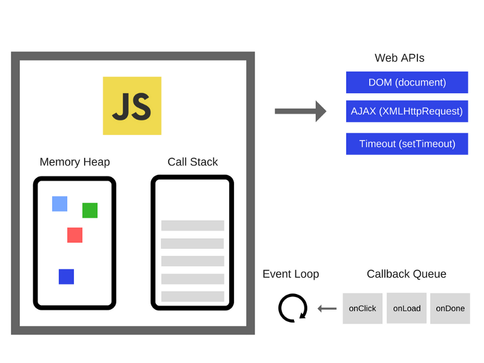
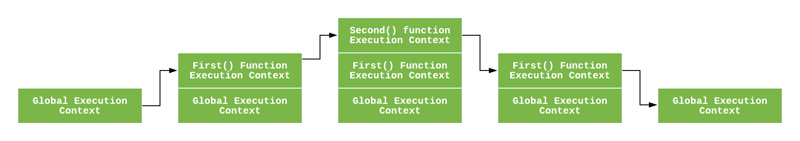

# 01_콜 스택

Created: Jun 13, 2020 10:14 AM

자바스크립트는 싱글 스레드 인터프리터이다. 한 번에 하나의 작업, 하나의 코드만 처리할 수 있다. 힙, 큐, 콜 스택은 자바스크립트의 부가 요소이다. 

## 콜 스택

 콜 스택은 현재 실행 중인 서브루틴에 관한 정보를 저장하는 스택 자료구조이다. 

 == 우리가 프로그램 상에서 어디 있는지 기록한다. 

 함수를 호출하면 콜 스택에 함수를 넣고, 종료(return) 되면 꺼낸다. 이 때, LIFO(Last In First Out) 으로 처리한다. 마지막으로 스택에 들어간 함수가 가장 먼저 나온다.

 함수를 호출하면 순서대로 스택 프레임이 생성된다. 

→ 콜 스택의 각 단계를 **스택 프레임**이라고 한다.

 에러가 나면 위에서 아래로 표시하며 알려준다. 

 콜 스택은 동기식이다.

무한 루프처럼 함수 호출 횟수가 너무 많아 콜 스택의 최대 허용치를 넘어가면 스택 오버플로우가 발생한다.

### 임시 저장소

 함수가 실행되면(리턴되면, 스택에서 나오면) 메모리를 차지하지 않는다. 반대로 실행할 때 콜 스택 안에 넣으면 메모리를 차지한다.

### 함수 실행 관리

 콜 스택은 다음에 어떤 함수를 실행할지 순서를 관리한다. 

## 힙

 변수와 객체에 대한 할당이 이루어지는 메모리 영역이다.

## 큐

== 메시지 큐, 이벤트 큐, 콜백 큐

큐에는 비동기로 처리될 콜백함수들이 저장된다.

이벤트 루프가 스택과 큐를 체크해서 스택이 비어있으면 큐에서 메시지(이벤트)를 꺼내 처리한다.

## 실행 컨텍스트

실행 컨텍스트는 실행 가능한 코드가 실행되기 위해 필요한 환경이다. 자바스크립트 엔진은 코드를 실행할 때마다 전역 실행 컨텍스트를 생성한다. 

이 때 실행 가능한 코드란, `전역 코드` , `Eval 코드` , `함수 코드` 이다.

그리고 실행을 위해 `변수` , `함수 선언` , `스코프` , `this` 등의 정보들을 형상화하고 구분하기 위해 자바스크립트 엔진은 실행 컨텍스트를 물리적 객체 형태로 관리한다.

실행 컨텍스트는 어휘 환경과 가변 환경에서 나타난다. (스코프, 바인딩)