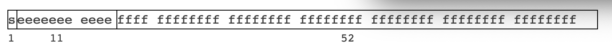

# 02_원시 자료형

Created: Jul 23, 2020 12:33 PM

## 자바스크립트 원시 타입

### Boolean

논리적인 요소를 나타내고, `true` 와 `false` 두 가지 값을 가진다.

### Null

 `null` 은 어떤 값이 의도적으로 비어있음을 표현한다.

불리언 연산에서 거짓으로 취급한다.

`undefined` 는 변수를 선언만 해도 할당되지만 `null` 은 변수 선언 후에 값을 할당해야 한다.

`tyleof null` 은 `object` 임에 주의.

### Undefined

값이 할당되지 않은 변수는 `undefined` 타입이 된다. 변수 자체의 값 또한 `undefined` 이다.

존재하지 않는 객체의 프로퍼티, 존재하지 않는 배열의 원소값이 접근하려 할 때 얻어지는 변수의 값이다.

즉, `undefined` 는 값이면서 데이터 타입이다.

### Number

자바스크립트 숫자는 모두 **부동 소수점**으로 IEEE 754 표준 (-(253 -1) 와 253 -1 사이의 숫자값)에 따라 저장된다. 구체적으로는 double-precision 형식으로, 각 부동에 64비트가 할당되어 있다는 것을 의미한다.



위 그림처럼 이진수의 64비트로 표시된다.

64비트 중 1비트는 기호(숫자가 음수인지 양수인지)에 사용된다. 11비트는 지수용으로 사용된다. 

나머지 52비트는 분수가 차지한다.

정수Integer 는 15자리까지 정확한 것으로 간주한다.

소수의 최대 수는 17이지만 부동 소수점 연산은 항상 100% 정확한 것은 아니다. 이런 문제를 해결하기 위해 곱셈, 나눗셈을 써서 표현할 수 있다.

`Infinity` , `NaN` 같은 상징적인 값들도 표현할 수 있다.

이진 연산자들로 비트 마스킹 기법을 통해 한 숫자 안에 여러 불리언 값을 저장하는 데도 쓸 수 있다.

### String

자바스크립트의 텍스트 데이터는 16비트 부호 없는 정수 값 요소들의 집합이다.

문자열의 길이는 가지고 있는 요소의 개수이다.

자바스크립트 문자열은 immutable 하다. 

### Symbol

심볼은 유일하고 immutable 하다. 

객체 속성의 key 값으로도 사용할 수 있다.

### 원시 타입과 객체

```jsx
typeof true; //"boolean"
typeof Boolean(true); //"boolean"
typeof new Boolean(true); //"object"
typeof (new Boolean(true)).valueOf(); //"boolean"
 
typeof "abc"; //"string"
typeof String("abc"); //"string"
typeof new String("abc"); //"object"
typeof (new String("abc")).valueOf(); //"string"
 
typeof 123; //"number"
typeof Number(123); //"number"
typeof new Number(123); //"object"
typeof (new Number(123)).valueOf(); //"number"
```

자바스크립트 원시타입에는 대응하는 래퍼 객체Wrapper object 가 있다. 원시타입을 감싸는 형태로 사용된다.

이러한 객체는 각각 `Boolean` , `String` , `Number` , `Symbol` 생성자의 인스턴스 이다.

```jsx
var a = "hello";
a.someProperty = 111; // new String(a).someProperty = 111
a.someProperty; // undefined
```

---

참고

[https://includestdio.tistory.com/26](https://includestdio.tistory.com/26)

[http://jun.hansung.ac.kr/CWP/Javascript/JavaScript Numbers.html](http://jun.hansung.ac.kr/CWP/Javascript/JavaScript%20Numbers.html)

[https://developer.mozilla.org/ko/docs/Web/JavaScript/Reference/Global_Objects/null](https://developer.mozilla.org/ko/docs/Web/JavaScript/Reference/Global_Objects/null)