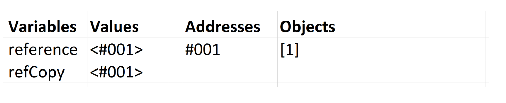
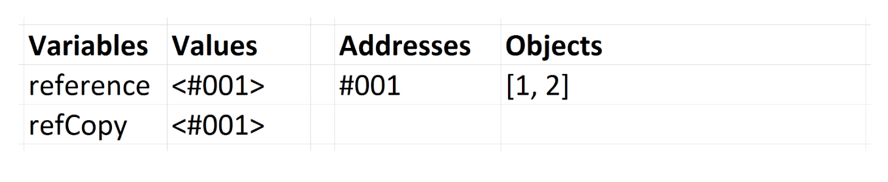
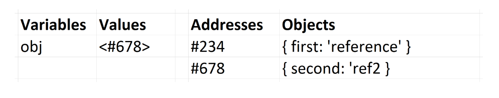

# 03_값과 참조 타입

Created: Jun 13, 2020 10:14 AM

자바스크립트의 데이터타입은 크게 원시 타입(Primitive Types)과 참조 타입(Reference Types)으로 나눌 수 있다.

원시 타입은 값에 의한 전달이 일어나고, 참조 타입은 참조에 의한 전달이 일어난다. 

## 원시 타입

String, Number, Boolean, Null, Undefined

원시 타입이 변수에 할당되면 해당 변수는 원시 타입 `값` 을 포함한다.

```jsx
var x = 10;
var y = 'abc';
var a = x;  // 10
var b = y;  // 'abc
```

`a` 는 `x` 의 값을 복사한 것이기 때문에, `a` , `b` 는 각각 값을 가진다.

`a` 값이 바뀐다고 해서 `x` 가 바뀌지 않는다.

```jsx
a = 5;
b = 'def';
console.log(x, y, a, b);
// 10, 'abc', 5, 'def'
```

## 참조 타입

Array, Function, Object → 크게 보면 전부 객체(Objects)로 볼 수 있다.

변수에 해당 `값에 대한 참조` 가 할당된다. 참조는 **메모리에서 객체의 위치**를 가리킨다. 변수에는 실제로 값이 포함되어있지 않다.

변수가 가리키는 메모리 주소는 정적이다. 

```jsx
1) var arr = [];
2) arr.push(1);
```

변수에 할당된 배열을 변경하면, 이 배열은 메모리에서 변한다.

```jsx
var reference = [1];
var refCopy = reference;
```

객체에 `=` 을 사용하여 다른 변수에 복사할 때, 그 값의 주소는 실제로 원시 타입처럼 복사된다. 

객체는 값 대신 참조로 복사된다.



```jsx
reference.push(2);
console.log(reference, refCopy); // -> [1, 2], [1, 2]
```



원본 값을 변경하면 같은 배열을 가리키고 있는 것을 볼 수 있다.

하지만 함수 내에서 데이터를 변경하면 외부 범위의 변수에 영향을 주지 않는다. → 클로저

### 참조 재할당

```jsx
var obj = { first: 'reference' };
obj = { second: 'ref2' }
```



`#234` 의 객체는 더 이상 사용하지 않으므로 가비지 콜렉션에 추가된다.