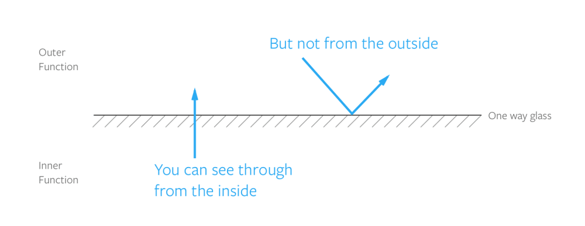

# 06_함수 범위, 블록 범위, 렉시컬(lexical) 범위

Created: Jun 13, 2020 10:14 AM

## 스코프란?

자바스크립트에서 어떤 변수에 접근할 수 있는지==변수의 유효범위를 정의한다.

**변수에 접근할 수 있는 범위**

### 스코프를 사용하는 이유

최소 접근의 원리. 불필요한 접근을 막는다.

스코프는 1. 버그를 추적하는 시간을 줄이고 2. 네이밍 문제를 해결할 수 있다.

## 전역Global 스코프

함수 바깥이나 `{}` 바깥에서 선언되었다면 전역 스코프에 정의된다.

하나의 자바스크립트 문서 → 하나의 전역 스코프

전역변수로 선언하면 코드 모든 곳에서 사용할 수 있다. 함수 내에서도 사용 가능하다.

이름이 충돌하거나 변수를 덮어쓸 수 있으므로 사용하지 않는 것이 좋다.

## 지역Local 스코프

코드의 특정 부분에서만 사용이 가능하다.

### 함수 스코프

함수를 선언할 때마다 새로운 스코프가 생성된다.

함수 내부에서 변수를 선언한다면, 선언한 함수 내에서만 변수를 사용할 수 있다.

- 함수 호이스팅과 스코프

    함수가 선언식으로 선언되면 현재 스코프의 최상단으로 호이스팅hoist 된다.

    ```jsx
    // 두 경우의 결과는 같다.
    sayHello() 
    function sayHello() {
    	console.log('Hello')
    }
    // ----------------------
    function sayHello() {
    	console.log('Hello')
    }
    sayHello()
    ```

    함수 표현식으로 선언되면 호이스팅 되지 않는다.

    ```jsx
    sayHello() // Error, sayHello is not defined
    const sayHello = function () {
    	console.log('Hello')
    }
    ```

    함수 호이스팅은 사용하지 말고, 호출 전에 함수를 선언하는 것이 좋다!

함수는 서로의 스코프에 접근할 수 없다. 어떤 함수를 다른 함수에서 사용할 경우에도 마찬가지이다.

### 블록 스코프

`{}` 내에서 선언한다면, 변수는 이 중괄호 블록 내부에서만 사용 가능하다.

`if`, `for`, `while` 같은 조건문, 반복문이 여기에 해당된다.

함수를 선언할 때 블록을 사용해야 하므로, (화살표 함수를 쓰는 게 아니라면) 블록 스코프는 함수 스코프의 서브셋이다.

- `var` 는 블록 스코프를 생성하지 않는다. (함수 스코프만)
- `let` `const` 는 지역 스코프를 생성한다.

    == 블록 스코프의 일관성을 유지할 수 있다.

- IIFE 를 사용하여 함수에 인자를 전달하는 방법으로도 스코프를 생성할 수 있다.

## 렉시컬Lexical 스코프

렉시컬 스코프는 함수를 어디서 호출하는지가 아니라 어디에 선언하였는지를 따른다. 

== 함수를 선언하는 시점에서 상위 스코프가 결정된다.

```jsx
var x = 1;

function foo() {
  var x = 10; // 그림자 식별자
  bar();
}

function bar() {
  console.log(x);
}

foo(); // 1
bar(); // 1
```

네스팅된 스코프Nested scopes

함수가 다른 함수 내부에서 정의되었다면, 내부 함수는 외부 함수의 변수에 접근할 수 있다.

하지만, 외부 함수는 내부 함수의 변수에 접근할 수 없다. → private 변수

```jsx
function outerFunction () {
  const outer = 'I’m the outer function!'
    
  function innerFunction() {
     const inner = 'I’m the inner function!'
     console.log(outer) // I’m the outer function!
  }
    
  console.log(inner) // Error, inner is not defined
}
```

