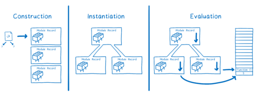

# 08. IIFE, Modules, Namespaces

Created: Jun 13, 2020 10:15 AM

# IIFE

즉시실행함수 표현법 Immediately invoked Function Expression

## 기존의 함수 표기

- 함수 선언문

    ```jsx
    function sayHi() {
    	alert("Hello");
    }
    sayHi();
    ```

    함수 선언은 호이스팅이 된다.

- 함수 표현식

    ```jsx
    var msg = "Hello";
    var sayHi = function() {
    	alert(msg);
    };
    sayHi();
    ```

    함수 표현은 호이스팅이 되지 않는다.

    이 때 함수는 **익명함수**이다.

    기명 함수로 표현해도 함수 이름으로 실행할 수는 없다.

    기명 함수의 장점은 stack trace 에서 함수를 식별하여 에러를 찾기 쉽다는 것.

## 즉시 실행 함수

선언과 동시에 호출한다.

```jsx
// 익명 즉시 실행 함수
(function() {
	alert("Hello");
}());

// 기명 즉시 실행 함수
(function sayHi() {
	alert("Hello");
}());

// 변수에 저장할 수도 있다.
(sayHi = function() {
	alert("Hello");
})();
sayHi();
```

함수 표현식처럼 익명 함수, 기명 함수 표현으로 사용할 수 있다.

### 즉시 실행 함수를 사용하는 이유

즉시 실행 함수는 외부에서의 변수 접근을 통제할 수 있다. 전역 변수에 추가하지 않아도 되어 코드 충돌을 방지할 수 있어서 다음과 같은 경우에 많이 사용한다.

**초기화**

한 번의 실행만 필요로 하는 초기화 코드에 많이 사용된다. 

전역에 변수를 추가하지 않아도 되기 때문에 코드 충돌 없이 구현할 수 있기 때문이다.

**라이브러리 전역 변수의 충돌**

jQuery 나 Prototype 라이브러리는 동일한 전역변수를 사용하는데, 즉시 실행 함수를 사용하여 전역 변수 충돌을 피할 수 있다.

## 즉시 실행 함수 variation

### 단항 연산자 사용

```jsx
!function() {
	alert("Hello");
}();

+function() {
	alert("Hello");
}();
```

`function` 을 첫 단어로 사용하면 자바스크립트가 함수 정의가 될것이라고 예상한다. 

`function` 앞에 `!` 또는 `+`, `-`, `~` 등 모든 단항 연사자를 사용해서 다음에 오는 것을 표현식으로 처리한다.

이렇게 하려 경우 `true`, `NaN`, ... 리턴 값이 있는데,

```jsx
void functon() {
	alert("Hello");
}();
```

`void` 역시 기본적으로 함수가 함수표현식으로 취급되게 하지만, 리턴 값은 없다.

### 괄호`()` 위치

```jsx
// #1
(function() {
	alert('hello');
}());

// #2
(function() {
	alert('hello');
})();
```

**#1 :** 함수를 호출하는 괄호 `()` 가 함수 표현식을 만드는 바깥 괄호 안에 포함

**#2 :** 함수를 호출하는 괄호 `()` 가 함수 표현식 밖에 있음

```jsx
function() {
	alert('hello');
}();
```

함수 표현식을 감싸는 괄호가 없으면 Syntax 에러가 발생한다.

괄호를 생략하고 싶으면,

```jsx
var sayHi = function() {
	alert('hello');
}();
```

확실한 함수 표현식으로 쓰면 된다.

## IIFE 의 scope

즉시 실행 함수 내부에서 선언된 변수는 외부에서 볼 수 없다.

```jsx
(function IIFE_initGame() {
    // Private variables that no one has access to outside this IIFE
    var lives;
    var weapons;
    
    init();

    // Private function that no one has access to outside this IIFE
    function init() {
        lives = 5;
        weapons = 10;
    }
}());
```

내부 변수 `lives` 와 `weapons` 는 외부에서 접근 할 수 있다.

함수 `init` 도 외부에서 접근할 수 없다. 하지만 `init` 함수는 `lives` 와 `weapons` 에 접근 할 수 있다.

## IIFE 의 return value

리턴 값이 필요하지 않다면 단항 연산자 `!`, `+`, `void` 등을 사용할 수 있다.

그러나 즉시 실행 함수도 함수 표현식이므로 변수에 리턴 값을 할당할 수 있다.

```jsx
var result = (function() {
	return "From IIFE";
}());

alert(result); // alerts "From IIFE"
```

## IIFE 의 parameters

```jsx
(function IIFE(msg, times) {
    for (var i = 1; i <= times; i++) {
        console.log(msg);
    }
}("Hello!", 5));
```

인수를 전달해서 사용할 수 있다.

즉시 실행 함수에 인수를 전달해 사용하는 장점은

1. 자바스크립트는 식별자를 찾을 때까지 상위 범위를 계속 탐색하는데, 즉시 실행 함수를 사용하면 독립된 스코프를 만들 수 있다.
2. Javascript minifier가 매개변수 이름들을 안전하게 minify 할 수 있다.

# 모듈Module

모듈이란 재사용할 수 있는 코드 스니펫이다.

## 왜 모듈을 사용하는가?

- 추상화: 라이브러리에 기능을 위임합니다. 구현의 복잡성을 이해할 필요 없습니다.
- 캡슐화: 모듈 내부의 코드를 숨깁니다.
- 재사용: 동일 코드의 반복을 피합니다.
- 의존성: 의존성을 쉽게 변경할 수 있습니다.

### 노출식 모듈 패턴 Revealing Module Pattern

([https://edykim.com/ko/post/revealing-module-pattern/](https://edykim.com/ko/post/revealing-module-pattern/))

명시적으로 노출될 메소더를 지정하는 디자인

IIFE와 유사하지만 반환된 값을 변수에 할당한다.

**장점**

- 개발자에게 깔끔한 접근 방법을 제공
- private 데이터 제공
- 전역 변수를 덜 더럽힘
- 클로저를 통해 함수와 변수를 지역화
- 스크립트 문법이 더 일관성 있음
- 명시적으로 public 메소드와 변수를 제공해 명시성을 높임

**단점**

- private 메소드 접근할 방법이 없음 (이런 메소드에 대한 테스트의 어려움을 이야기하기도 하지만 함수 무결성을 고려할 때 공개된 메소드만 테스트 하는게 맞음. 관련 없지만 기록용으로.)
- private 메소드에 대해 함수 확장하는데 어려움이 있음
- private 메소드를 참조하는 public 메소드를 수정하기 어려움

```jsx
var myModule = (function(window, undefined) {
  function myMethod() {
    console.log('myMethod');
  }

  function myOtherMethod() {
    console.log('myOtherMethod');
  }

  return {
    someMethod: myMethod,
    someOtherMethod: myOtherMethod
  };
})(window);

myModule.myMethod(); // Uncaught TypeError: myModule.myMethod is not a function
myModule.myOtherMethod(); // Uncaught TypeError: myModule.myOtherMethod is not a function
myModule.someMethod(); // console.log('myMethod');
myModule.someOtherMethod(); // console.log('myOtherMethod');
```

이런 패턴 대신 ES6 모듈을 사용할 수 있다.

모듈은 자신의 스코프를 선언하고, 모듈 내부의 변수는 역시 전역 객체를 오염시키지 않는다.

## 모듈 형식

### CommonJS format

Node.js 에서 사용

```jsx
var dep1 = require('./dep1');  
var dep2 = require('./dep2');

module.exports = function(){  
  // ...
}
```

### ES6 module format

자바스크립트 공식 표준화 모듈

`import`, `export`, `export default` 를 사용

함수만 아니라 변수 등을 내보낼 수 있다.

모듈 번들러 없이 `<script type="module">` 로 사용할 수 있다.

**ES 모듈의 수행 단계**

1. Construction - 모든 파일을 찾아 다운로드하고 모듈 레코드로 파싱합니다.
2. Instantiation - 내 보낸 값을 모두 배치하기 위해 메모리에있는 상자를 찾습니다(그러나 값을 아직 채우지는 않음). 그런 다음 exports와 imports 모두 메모리의 해당 상자를 가리 킵니다. 이를 링크라고합니다.
3. Evaluation - 코드를 실행하여 변수의 실제 값으로 상자를 채웁니다.



## 모듈 로더, 번들러

### 모듈 로더

모듈 로더는 특정 모듈 형식으로 작성된 모듈을 해석하고 읽는다.

런타임에 모듈 로더가 실행된다.

SystemJS 등

### 모듈 번들러

모듈 로더를 대체한다. 빌드 시에 실행된다. 빌드할 때 번들 파일을 생성해서 브라우저에서 이 번들 파일을 로드한다.

웹팩 등

- 처리가 자동화되어 있어서 사람이 실수할 수 있는 가능성이 적다.
- 추가적인 처리는 코드를 삽입하고, 디버깅 명령들을 제거하며, 최종 결과의 파일을 압축minify하는 등의 작업을 수행할 수 있다.
- TypeScript 와 같은 대체 문법을 사용할 수 있다.