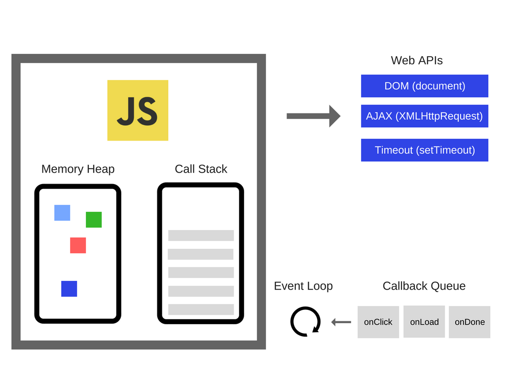

# 09_메시지 큐와 이벤트 루프

Created: Jun 15, 2020 10:51 AM

# blocking 과 none blocking

처리되어야 하는 (하나의) 작업이, 전체적인 작업 '흐름'을 막느냐 안막느냐에 대한 관점

(동기, 비동기는 처리해야 할 작업들을 어떠한 '흐름'으로 처리 할 것인가에 대한 관점)

자바스크립트는 논블로킹 언어이다. (파이썬은 블로킹 언어)

# 메시지 큐와 이벤트 루프

## 메시지 큐

함수를 실행하면 스택에서  Web API(브라우저에 의해 실행) 로, 메시지 큐로 옮겨 실행한다.

메시지 큐에서 메시지 == Web API 에서 온 메시지

스택에 아무것도 없을 때 메시지 큐에 있는걸 가져가서 실행한다.

## 이벤트 루프

### 이벤트루프란?

**이벤트루프는 콜 스택과 콜백 큐(메시지 큐)를 모니터링한다.**

**콜 스택이 비어있으면 메시지 큐의 첫번째 이벤트가 콜 스택에 전달, 실행된다.**

이러한 반복을 이벤트 루프의 틱tick 이라고 한다.

본래 이벤트 루프는 자바스크립트 호스팅 환경의 내장 메커니즘이다. 

### setTimeout()

`setTimeout` 은 지정된 시간 후에 콜백을 실행하지 않는다. 콜백이 실행되는 **최소시간**을 보장한다.

타이머 자체는 콜백 대기열(메시지 큐)에 콜백을 넣지 않기 때문이다. 타임아웃이 0이 되면 타이머는 만료되고, 콜백은 메시지 큐에 배치되었다가 이벤트 루프가 스택이 비면 콜 스택에 푸시한다.

### 이벤트 루프의 동시성concurrency

자바스크립트 런타임은 한 번에 한 가지만 할 수 있지만, 브라우저를 통해 동시에 코드를 실행할 수 있다. 즉, 자바스크립트 런타임이 아니라 브라우저 Web API 로 처리한다.

한 가지 작업을 할 때 다른 일이 차단되지 않는다. == non-blocking

블로킹이 예외이므로 자바스크립트는 콜백으로 코드를 처리하고, 혹은 `promise` , `async/await` 로 실행한다.

### Job queue

tick 끝에 첨부되는 대기열. 나중에 실행할 다른 기능을 추가하여 우선순위를 부여한다. 

Job 은 여러 개 추가할 수 있다.

## 클로저

클로저는 환경을 유지한다. 함수 처리가 끝난 뒤에도 클로저를 통해 참조가 유지되기 때문에 garbage collection 에 수집되지 않는다. 

클로저가 처리된 뒤에 참조되었던 변수가 garbage collection 으로 들어간다.
