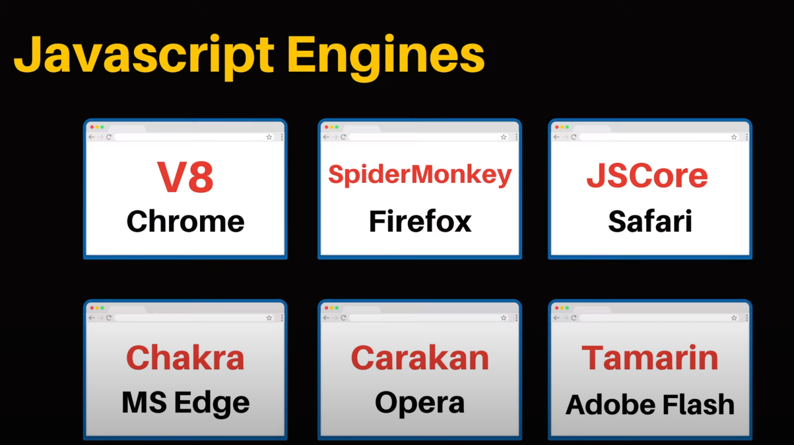
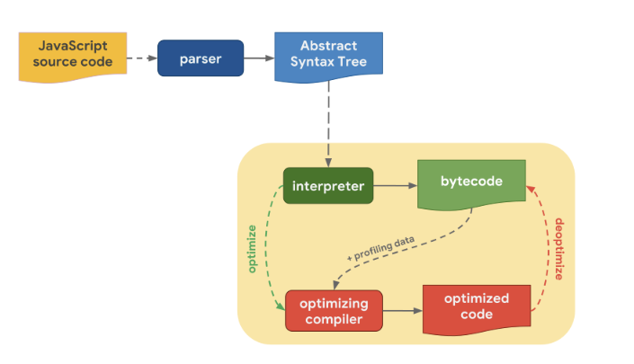
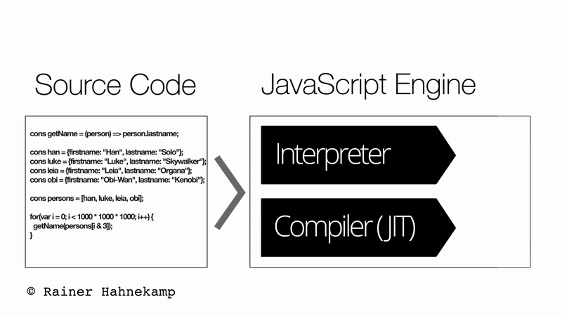
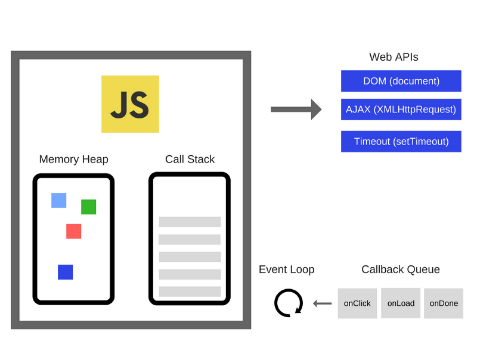

# 11_자바스크립트 엔진

Created: Jun 16, 2020 9:18 PM

# 자바스크립트 엔진

자바스크립트 엔진은 자바스크립트 코드를 실행하는 프로그램 혹은 인터프리터를 말한다. 

즉, 자바스크립트 코드를 읽고 컴파일한다. == 자바스크립트를 기계어로 바꿔서 프로그램이 동작하게 한다.

개발자가 작성한 자바스크립트 코드를 빠르게 변환하고, 애플리케이션에 내자화하거나 브라우저가 해석 가능하도록 최적화 하는 것에 목적이 있다.

자바스크립트 엔진은 표준적인 인터프리터로 구현될 수도 있고,

혹은 자바스크립트 코드를 바이트코드로 컴파일하는 just-in-time 컴파일러로 구현할 수도 있다.

이미지 출처([https://www.youtube.com/watch?v=wcsVjmHrUQg](https://www.youtube.com/watch?v=wcsVjmHrUQg))

브라우저 간의 자바스크립트 엔진 차이 때문에 특정 스크립트가 여러 브라우저에서 다른 속도로 작동하는 것이다.

## V8 엔진

V8 엔진이 속도를 향상한 가장 큰 원인은 인터프리터와 컴파일러의 결합이다. 

인터프리터는 소스 코드를 실행하고, 컴파일러는 사용자 시스템이 직접 실행하는 시스템 코드를 생성한다.

### V8 특징

- JavaScript 소스 코드를 컴파일 하고, 실행한다.
- 생성하는 Object 를 메모리에 할당한다.
- 가비지 콜렉션을 이용해 더 이상 사용되지 않는 Object 의 메모리를 해제한다.
- Hidden Class 를 이용해 빠르게 프로퍼티에 접근한다.
- TurboFan 을 이용해 최적화된 코드로 만들어 속도 및 메모리를 최적화한다.

### V8 엔진의 작동 구조

출처: [https://mathiasbynens.be/notes/shapes-ics](https://mathiasbynens.be/notes/shapes-ics)

1. 인터프리터가 바이트코드를 생성, 실행한다. 바이트코드를 캐싱해둔다.
2. 이 때 자주 수행되는 코드를 식별한다. 인라인 캐싱과 같은 최적화 기법으로 최적화한 후 , 이후 컴파일할 때 참조한다.

⇒ 이러한 방식의 컴파일러를 JIT(Just-In-Time) 컴파일러라고 한다. 인터프리터보다 빠르다.

V8 은,

- **컴파일 과정**
    1. **Blink** 에서 `<script>` 태그를 만나면, Javascript **스트리밍** 을 시작한다.
    2. 스트리밍 으로 전달 받은 UTF-16 문자열은 **Scanner** 를 이용해 **Token** (let, for) 을 생성한다.
    3. 생성된 **Token** 을 가지고, **Parser** 가 **추상 구문 트리 (AST)** 를 만든다.
    4. 만들어진 **AST** 는 **Ignition (Compiler)** 에서 **Byte Code** 로 컴파일한다.
    5. 컴파일된 **Byte Code** 를 실행함으로써 원하는 Javascript 동작이 실행된다.
- 이 때 컴파일한 내용을 **최적화**시킨다.
    - **Byte Code** 를 실행하면서, **Profiling** 을 통해 최적화 해야 하는 데이터(뭐가 제일 핫한지)를 수집한다.
    - **Profiling** 을 통해 찾은 데이터는 `TurboFan` 을 통해 자주 사용되는 함수나 데이터를 기반으로 최적화를 진행하며, **Optimized Machine Code** 를 생성한다.
    - 이후 **Optimized Machine Code** 를 실행하며, 메모리 사용량을 줄이고, 기계어에 최적화되어, 속도와 성능을 향상 시킨다.

([https://medium.com/@pks2974/v8-에서-javascript-코드를-실행하는-방법-정리해보기-25837f61f551](https://medium.com/@pks2974/v8-%EC%97%90%EC%84%9C-javascript-%EC%BD%94%EB%93%9C%EB%A5%BC-%EC%8B%A4%ED%96%89%ED%95%98%EB%8A%94-%EB%B0%A9%EB%B2%95-%EC%A0%95%EB%A6%AC%ED%95%B4%EB%B3%B4%EA%B8%B0-25837f61f551))

### V8 의 히든 클래스

자바스크립트는 동적 타이핑 언어이다. 프로퍼티를 효과적으로 다루는 것이 속도를 높이는 핵심이다.

동적 타이핑 언어는 컴파일할 때 프로퍼티의 메모리 오프셋을 결정할 수 없다.

실제로 프로퍼티 값에 접근했을 때 데이터 타입이나 순서가 달라질 수 있기 때문이다.

즉, 프로퍼티 값을 읽을 때마다 프로퍼티를 동적 탐색해야 한다.

V8은 런타임에 히든 클래스를 생성하여 동적 탐색을 피하고 프로퍼티 액세스 시간을 향상시킨다.

히든 클래스의 특징

- 객체는 반드시 하나의 히든 클래스를 참조한다.
- 히든 클래스는 각 프로퍼티에 대해 메모리 오프셋을 가지고 있다.
- 동적으로 새로운 프로퍼티가 만들어질 때, 혹은 기존 프로퍼티가 삭제되거나 기존 프로퍼티의 데이터 타입이 바뀔 때는 신규 히든 클래스가 생성되며, 신규 히든 클래스는 기존 프로퍼티에 대한 정보를 유지하면서 추가적으로 새 프로퍼티의 오프셋을 가지게 된다.
- 히든 클래스는 프로퍼티에 대해 변경이 발생했을 때 참조해야 하는 히든 클래스에 대한 정보를 갖는다. == **전환 정보**
- 객체에 새로운 프로퍼티가 만들어지면, 현재 참조하고 있는 히든 클래스의 **전환 정보**를 확인한 후, 현재 프로퍼티에 대한 변경이 전환 정보의 조건과 일치하면, 객체의 참조 히든 클래스를 조건에 명시된 히든 클래스로 변경시킨다.

(참고: [https://engineering.linecorp.com/ko/blog/v8-hidden-class/](https://engineering.linecorp.com/ko/blog/v8-hidden-class/))

⇒ 그리고 이렇게 프로퍼티를 히든 클래스로 기억해놓고 다시 조회하는 것이 인라인 캐싱Inline caching 방식이 아닌가...

V8 엔진은

- 메모리힙(Memory Heap): 메모리 할당이 이루어지는 곳
- 콜 스택(Call Stack): 코드가 실행되면서 스택 프레임이 쌓이는 곳

두 부분으로 구성된다.

## 런타임

프로그래밍 언어가 구동되는 **환경**이다.

Node.js 나 크롬 등의 브라우저들이 자바스크립트 런타임이다.

브라우저에는 거의 모든 API 가 있다. (`setTimeout` 등)

이 API 는 엔진이 아니라 런타임이 제공한다.

---

참고

[https://beomy.github.io/tech/javascript/javascript-runtime/](https://beomy.github.io/tech/javascript/javascript-runtime/)

[https://engineering.huiseoul.com/자바스크립트는-어떻게-작동하는가-엔진-런타임-콜스택-개관-ea47917c8442](https://engineering.huiseoul.com/%EC%9E%90%EB%B0%94%EC%8A%A4%ED%81%AC%EB%A6%BD%ED%8A%B8%EB%8A%94-%EC%96%B4%EB%96%BB%EA%B2%8C-%EC%9E%91%EB%8F%99%ED%95%98%EB%8A%94%EA%B0%80-%EC%97%94%EC%A7%84-%EB%9F%B0%ED%83%80%EC%9E%84-%EC%BD%9C%EC%8A%A4%ED%83%9D-%EA%B0%9C%EA%B4%80-ea47917c8442) 

[https://engineering.huiseoul.com/자바스크립트는-어떻게-작동하는가-v8-엔진의-내부-최적화된-코드를-작성을-위한-다섯-가지-팁-6c6f9832c1d9](https://engineering.huiseoul.com/%EC%9E%90%EB%B0%94%EC%8A%A4%ED%81%AC%EB%A6%BD%ED%8A%B8%EB%8A%94-%EC%96%B4%EB%96%BB%EA%B2%8C-%EC%9E%91%EB%8F%99%ED%95%98%EB%8A%94%EA%B0%80-v8-%EC%97%94%EC%A7%84%EC%9D%98-%EB%82%B4%EB%B6%80-%EC%B5%9C%EC%A0%81%ED%99%94%EB%90%9C-%EC%BD%94%EB%93%9C%EB%A5%BC-%EC%9E%91%EC%84%B1%EC%9D%84-%EC%9C%84%ED%95%9C-%EB%8B%A4%EC%84%AF-%EA%B0%80%EC%A7%80-%ED%8C%81-6c6f9832c1d9)

[https://www.youtube.com/watch?v=5nmpokoRaZI&feature=youtu.be](https://www.youtube.com/watch?v=5nmpokoRaZI&feature=youtu.be)