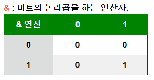
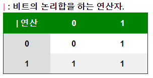
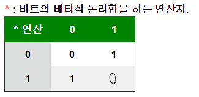

# 12_비트 연산자, 형식화 배열, 버퍼(배열)

Created: Jun 18, 2020 11:59 AM

# 비트 연산자

## 비트 연산

주어진 수를 이진수(==32비트 부호 있는 정수signed integer)로 변환 

→ 비교 

→ 비교 결과를 십진수(==64비트 자바스크립트 숫자)로 변환 및 출력하는 것

자바스크립트는 숫자를 64비트 부동 소수점 수로 저장하지만,

모든 비트 연산은 32비트 이진수로 수행한다.

### 이진수 변환

자바스크립트에서 이진형식으로 변환

```jsx
Number(113).toString(2) // 1110001
```

직접 이진수를 입력할 수 있다.

```jsx
// function parseInt 
parseInt(1111, 2) //15

// 0b
0b101 //5
```

## 비트 연산자

- & : 비교하는 비트가 모두 1이면 1 반환(AND)
- | : 비교하는 비트 중에서 하나라도 1이면 1 반환(OR)
- ^ : 비교하는 비트가 같으면 0, 다르면 1 반환(XOR, 보수법)
- ~ : 다른 연산자와는 다르게 연산을 진행하는 피연산자는 하나뿐이며, ! 연산자와 비슷한 부정연산자로 비트의 값들을 뒤짚는다
- << : 지정한 수만큼 비트 전체를 왼쪽으로 이동(left shift)
- >> : 지정한 수만큼 비트 전체를 오른쪽으로 이동(right shift)
- >>> : 지정한 수만큼 비트를 전부 오른쪽으로 이동, 새로운 비트는 전부 0이 된다

### `&` (AND)

피연산자를 비트로 바꿨을 때 각각 대응하는 비트가 모두 1이면 그 비트값에 1을 반환.



```jsx
12 & 15 // 12
// 1100 & 1111 -> 1100
12 & 10 // 8
// 1100 & 1010 ->  1000
```

### `|` (OR)

피연산자를 비트로 바꿨을 때 각각 대응하는 비트가 모두 1이거나 한 쪽이 1이면 1을 반환.



```jsx
12 | 15 // 15
// 1100 | 1111 -> 1111
12 | 10 // 14
// 1100 | 1010 -> 1110
```

### `^` (XOR)

피연산자를 비트로 바꿨을 때 대응하는 비트가 서로 다르면 1을 반환.



```jsx
12 ^ 15 // 3
// 1100 ^ 1111 -> 11
12 ^ 10 // 6
// 1100 ^ 1010 -> 110
```

### `~` (NOT)

피연산자의 반전된 값을 반환.

비트의 부정 연산을 하는 연산자.

```jsx
~ 12 // -13
~ 15 // -16
~ 10 // -11
```

### `<<`

왼쪽으로 시프트shift == 비트를 `n` 번 움직이는 연산자.

```jsx
12 << 1 // 24
15 << 1 // 30
```

### `>>`

오른쪽으로 `n` 번 시프트 연산하는 연산자.

a를 2 진수로 b 비트를 오른쪽으로 시프트하고, 제거 된 비트를 제거한다.

```jsx
12 >> 1 // 6
15 >> 1 // 7
```

### `>>>`

a를 2 진수로 b 비트를 오른쪽으로 시프트하고, 시프트 오프 한 비트를 버리고, 

왼쪽에서 0을 시프트한다.

## 비트연산자를 사용하는 이유

1. 속도가 빠르다.
2. 플래그 처리하기 쉽다.

    32비트는 총 32개의 속성을 줄 수 있다.