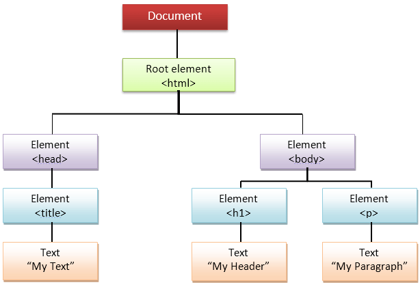
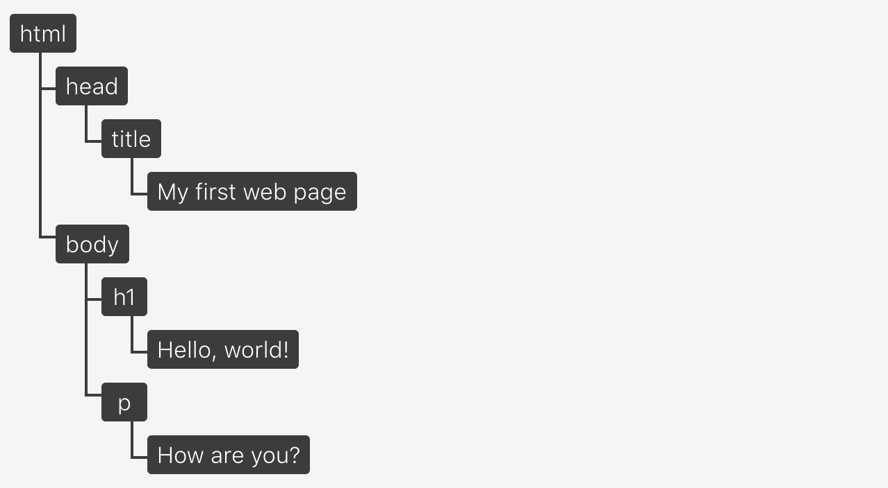

# 13_DOM과 Layout Trees

Created: Jun 18, 2020 11:32 PM

# DOM

## DOM은 무엇인가?

문서 객체 모델, Document Object Model

DOM은 웹 브라우저로부터 HTML, XML을 표현하기 위한 **인터페이스**를 제공한다.

이 인터페이스는 프로그램들이 페이지의 콘텐츠 및 구조, 그리고 스타일을 읽고 조작할 수 있도록 한다.

-

DOM은 문서의 구조화된 표현(structured representation)을 제공하며 프로그래밍 언어가 DOM 구조에 접근할 수 있는 방법을 제공하여 그들이 문서 구조, 스타일, 내용 등을 변경할 수 있게 돕는다. DOM은 구조화된 nodes와 property 와 method 를 갖고 있는 objects로 문서를 표현한다. 이들은 웹 페이지를 스크립트 또는 프로그래밍 언어들에서 사용될 수 있게 연결시켜주는 역할을 담당한다.

DOM은 웹 페이지의 객체 지향 표현이며, 자바스크립트와 같은 스크립팅 언어를 이용해 DOM을 수정할 수 있다.

([https://developer.mozilla.org/ko/docs/Web/API/Document_Object_Model/소개](https://developer.mozilla.org/ko/docs/Web/API/Document_Object_Model/%EC%86%8C%EA%B0%9C))

API (web or XML page) = DOM + JS (scripting language)

**넓은 의미로는 웹 브라우저가 HTML 페이지를 인식하는 방식,**

**좁은 의미로는 document 객체와 관련된 객체 집합이다.**

### Document Object

`document` 로 DOM 객체에 접근할 수 있다.

`element` 는 DOM node이다. 즉 자바스크립트 이벤트를 발생시키는 것은 DOM node가 하는 것이다.

그리고 이 `document` 는 HTML 소스 코드가 같아 보이는데 어떤 차이가 있는가..

## DOM과 HTML의 차이

HTML이 브라우저에서 파싱되어 DOM으로 변환된다.

DOM에서 모든 HTML 태그는 객체이다. 이 객체들은 자바스크립트로 접근 가능하다.

### HTML과 다른 DOM의 특징

- DOM은 클라이언트 측 자바스크립트로 수정된다.

    자바스크립트로 수정한 코드는 DOM의 일부가 된다.

    하지만 웹사이트 소스는 변경되지 않아 새로고침하면 원래대로 돌아오는 것을 알 수 있다.

- 브라우저가 자동으로 소스 코드의 오류를 수정한다.

    HTML에는 오류가 있어도, 브라우저가 수정해서 DOM과 코드가 다를 수 있다.

- DOM은 브라우저에서 보이는 것이 아니다.

    렌더링 되는 요소만 관련있기 때문에 시각적으로 보이지 않는 요소는 제외된다.

    예를 들어 `display: none` 은 보이지 않는다.

    `
` 또한 렌더 트리엔느 포함되지 않는다.

- DOM은 개발도구에서 보이는 것이 아니다.

    DOM과 가장 가까운 근사치를 제공하지만, DOM에 없는 정보도 포함하고 있다.

    `::after` 같은 가상 요소는 DOM에 포함되지 않는다.

    가상 요소가 DOM의 일부가 아니기 때문에 자바스크립트로 수정할 수 있다.

HTML에 있는 것은 DOM 트리에도 반드시 있어야 한다.

DOM을 통해 HTML 주석에도 접근할 수 있다.

## 자바스크립트와 DOM

문서 객체는 크게 두 가지 방법으로 생성된다.

1. 웹 브라우저가 HTML 페이지에 적혀 있는 태그를 읽으면 생성

    ⇒ 정적 생성

2. 원래 HTML 페이지에 없던 문서 객체를 자바스크립트를 이용해 생성

    ⇒ 동적 생성

## DOM 트리

DOM은 아래처럼 트리Tree 형식을 취한다.

트리 구조는 HTML에서 문서를 가장 잘 표현하는 방법이다.

DOM의 노드 트리 예시

---

참고

[https://wit.nts-corp.com/2019/02/14/5522](https://wit.nts-corp.com/2019/02/14/5522)

[https://corock.tistory.com/471#recentComments](https://corock.tistory.com/471#recentComments)