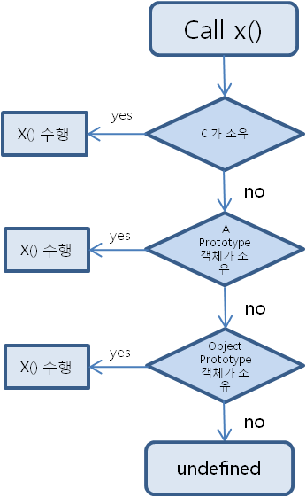

# 17_프로토타입의 상속과 체인

Created: Jun 24, 2020 2:43 AM

# 프로토타입 체인

## Prototype

자바스크립트는 프로토타입 기반 언어이다.

자바스크립트의 객체(object)는 null 이거나 다른 객체를 참조하는 숨겨진 속성인 `[[Prototype]]`을 가지고 있다. 이 객체를 "프로토타입"이라 한다.

`__proto__` 는 `[[Prototype]]` 을 위한 getter/setter 이다.

`__proto__` 의 값은 객체 혹은 `null` 이어야 한다. 원시 타입 X


```jsx
function Person() {
  this.eyes = 2;
  this.nose = 1;
	// 생성자 함수의 this 는 생성자 함수에 의해 생성될 객체를 가리킨다.
}

var kim  = new Person();
var park = new Person();

console.log(kim.eyes);  // => 2
console.log(kim.nose);  // => 1

console.log(park.eyes); // => 2
console.log(park.nose); // => 1
```

이런식으로 객체를 만들면 매번 객체와 변수가 메모리에 할당된다.

```jsx
function Person() {}

Person.prototype.eyes = 2;
Person.prototype.nose = 1;

var kim  = new Person();
var park = new Person():

console.log(kim.eyes); // => 2
```

프로토타입으로 이런 문제를 해결한다.

`Person.prototype` 이라는 빈 `Object` 가 어딘가에 존재하고,

`Person` 함수로 생성된 객체는 어딘가에 존재하는 오브젝트에 들어있는 값을 갖다쓸 수 있다.

1. **prototype :** 자바스크립트로 작성한 모든 기능의 속성으로 지정된 특수 객체. 자바스크립트가 제공하는 내부 함수 (및`bind`에 의해 반환 된 함수)에는 필수 항목이 아닌 모든 함수에 대해 이미 존재한다. 이 `prototype`은 (`new` 키워드를 사용하여) 그 함수에서 새로 생성 된 객체의`[[Prototype]]`이 가리키는 것과 동일한 객체이다.
2. **Prototype :** 객체에서 읽혀지는 일부 속성을 사용할 수 없는 경우 실행중인 컨텍스트가 액세스하는 모든 객체의 숨겨진 속성이다. 이 속성은 단순히 객체가 만들어진 함수의 `프로토 타입` 에 대한 참조이다. 스크립트에는 **getter-setter**라는 __proto__를 사용하여 액세스 할 수 있다. 프로토타입에 액세스 할 때 `[[Prototype]]` `__proto__`을 사용한다.

## Prototype Object

`Object` 도 사실 자바스크립트 함수이다.

함수가 정의될 때는

1. 해당 함수에 생성자Constructor 자격 부여

    `new` 를 통해 객체를 만든다. 함수만 `new` 키워드를 사용할 수 있다.

2. 함수의 `Prototype Object` 생성

    

    생성된 함수는 `prototype` 속성을 통해 `Prototype Object` 에 접근할 수 있다.

    이 프로토타입 객체의 기본 속성이 `constructor` 와 `__proto__` 이다.

    프로토타입 객체는 일반적 객체이므로 속성을 추가/삭제할 수 있다.

## Prototype Link

`__proto__` 는 모든 객체가 가지고 있는 속성인데,

객체가 생성될 때 조상이었던 함수의 프로토타입 객체를 가리킨다. (this 얘긴가!)

객체가 어떤 속성을 직접 가지고 있지 않으면 상위 프로토타입을 계속 탐색한다.

최상위인 `Object` 의 프로토타입 객체까지 도달해도 못찾을 경우 `undefined` 를 반환한다.

이렇게 **`__proto__` 속성을 통해 상위 프로토타입과 연결되어 있는 형태를 프로토타입 체인이라고 한다.**

프로토타입 체인 구조 때문에 모든 객체는 `Object` 의 자식이라고 할 수 있으며,

`Object` 프로토타입 객체의 모든 속성(`toString` 함수 같은)을 사용할 수 있다.

### 프로토타입 체인

자바스크립트는 프로토타입 체인 때문에 상속만 가능하다.

하위 객체에서 상위 객체의 프로퍼티와 메서드를 상속받는다. 

동일한 이름으로 재정의하지 않는 이상 그대로 사용한다.

사실 상속보다 **프로토타입 체인에 의한 공유**라고 해야 맞다.



`.prototype` 으로 정의한 것이 아니라 객체 생성 당시 포함한 메서드 혹은 프로퍼티라면

공유가 아니라 상속된다.

```jsx
var A= function() {};
var B = new A();
A.prototype.x='hello';
console.log(B);
```

```jsx
var A= function() {this.x='hello';};
var B = new A();
console.log(B);
```

```jsx
let Animals = {}; // Animal inherits object methods from Object.prototype.

Animals.eat = true; // Animal has an own property - eat ( all Animals eat ).

let Cat = Object.create(Animals); // Cat inherits properties from Animal and Object.prototype.

Cat.sound = true; // Cat has it's own property - sound ( the animals under the cat family make sounds).

let Lion = Object.create(Cat); // Lion ( a prestigious cat ) inherits properties from Cat, Animal, and Object.prototype.

Lion.roar = true; // Lion has its own property - roar ( Lions can raw )

console.log(Lion.roar); // true - This is an "own property".

console.log(Lion.sound); // true - Lion inherits sound from the Cat object.

console.log(Lion.eat); // true - Lion inherits eat from the Animal object.

console.log(Lion.toString()); // "[object Object]" - Lion inherits toString method from Object.prototype.
```

✔ 한 객체는 두 개의 객체에서 동시에 상속받을 수 없다.

✔ `obj.hasOwnProperty(key)` 를 사용해 상속받은 속성을 걸러낼 수 있다.


# Class 에서 상속

클래스는 기존의 프로토타입 기반 상속에 대한 syntatical sugar 이다.

```jsx
class Animal {

  constructor(name, fierce){
    this._name = name;
    this._fierce = fierce;
  }

  get name() {
    return this._name;
  }

  get fierce() {
    return ` This animal is ${ this._fierce ? 'fierce' : 'tame' }`;
  }

  toString() {
     return `This is a ${ this._fierce ? 'fierce' : 'tame' } ${this._name}`;
  }

}

class Felidae extends Animal {

  constructor(name, fierce, family){
    super(name, fierce);
    this._family = family;
  }

  family() {
     return `A ${this._name} is an animal of the ${this._family} subfamily under the ${Felidae.name} family`;
  }
}
```

---

참고

[https://medium.com/@bluesh55/javascript-prototype-이해하기-f8e67c286b67](https://medium.com/@bluesh55/javascript-prototype-%EC%9D%B4%ED%95%B4%ED%95%98%EA%B8%B0-f8e67c286b67)

[http://insanehong.kr/post/javascript-prototype/](http://insanehong.kr/post/javascript-prototype/)