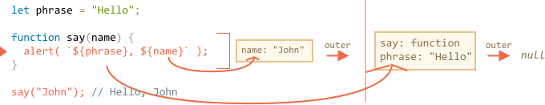

# 21_클로저Closure

Created: Jun 28, 2020 10:21 PM

# 클로저

## 어휘적Lexical 환경

자바스크립트에서 모든 동작하는 함수 블럭과 스크립트는 내부적인 연관된 오브젝트를 어휘적인lexical 환경으로서 갖는다.

코드를 적는 순간 둘러싼 정적 유효범위, 즉 렉시컬 스코프가 정해진다.

"lexical"이란, 어휘적 범위 지정(lexical scoping) 과정에서 변수가 어디에서 사용 가능한지 알기 위해 그 변수가 소스코드 내 어디에서 선언되었는지 고려한다는 것을 의미한다.

- 어휘적 환경 오브젝트
    1. *환경 기록(Environment Record)* - 모든 지역 변수를 프로퍼티로 갖고 있는 오브젝트 (그리고 `this`의 값과 같은 다른 정보들도)
    2. *외부 어휘 환경(outer lexical environment)* 에 대한 참조, 외부 코드에 관련된 것

즉, 변수는 특별한 내부 오브젝트(환경기록)의 프로퍼티이다.

변수를 가져오거나 변경하는 것은 그 오브젝트의 프로퍼티를 가져오거나 변경하는 것을 의미한다.

```javascript
function init() {
  var name = "Mozilla"; // name은 init에 의해 생성된 지역 변수이다.
  function displayName() { // displayName() 은 내부 함수이며, 클로저다.
    alert(name); // 부모 함수에서 선언된 변수를 사용한다.
  }
  displayName();
}
init();
```

여기서 `displayName()` 내부에는 지역 변수가 없지만, 함수 내부에서 외부 함수의 변수에 접근할 수 있기 때문에 `init()` 의 변수 `name` 에 접근해서 사용한다.

`displayName()` 이 `name` 변수를 가지고 있었다면, `this.name` 으로 사용했을 것이다.

### 함수 선언

함수는 어휘적 환경이 만들어질 때 초기화된다. (최상위 함수는 스크립트가 시작될 때)

그리고 모든 함수들은 "태어나는 순간(on birth)"에 함수 생성의 어휘 환경 참조를 가진 숨겨진 프로퍼티 `[[Environment]]` 를 받는다.

### 내부와 외부 어휘 환경

내부 어휘 환경은 외부 어휘 환경에 대한 참조를 갖는다.

코드에서 변수에 접근할 때, 내부 어휘 환경이 먼저 검색되고 외부 어휘 환경을 검색한다.

더욱 외부에 있는 어휘 환경을 거쳐 전역까지 도달한다.

어디에도 변수가 발견되지 않았을 때 `undefined` 를 반환하거나 `user strict` 일 때는 에러가 발생한다.



함수는 외부 변수에 접근이 가능하지만 가장 가까운 값을 사용한다.

## 클로저

```jsxjavascript
function makeFunc() {
  var name = "Mozilla";
  function displayName() {
    alert(name);
  }
  return displayName;
}

var myFunc = makeFunc();
// myFunc변수에 displayName을 리턴함
// 유효범위의 어휘적 환경을 유지
myFunc();
// 리턴된 displayName 함수를 실행(name 변수에 접근)
```

`makeFunc()` 을 실행하고(`displayName` 함수가 리턴되면) `name` 변수에 더 이상 접근할 수 없을 것 같지만, 위에서와 같은 결과가 나온다.

리턴하는 함수가 **클로저**를 형성하기 때문이다.

**클로저는 함수와 함수가 선언된 어휘적 환경의 조합이다.**

외부의 변수를 기억하고 접근할 수 있다.

이 때 어휘적 환경은 클로저가 생성된 시점의 유효범위 내에 있는 모든 지역 변수로 구성된다.

자바스크립트의 모든 함수는 자연적으로 클로저이다. (`new` 는 예외)

`displayName` 의 인스턴스는 변수 `name` 이 있는 어휘적 환경에 대한 참조를 유지한다.

```javascript
function makeAdder(x) {
  var y = 1;
  return function(z) {
    y = 100;
    return x + y + z;
  };
}

var add5 = makeAdder(5);
var add10 = makeAdder(10);
// 클로저에 x와 y의 환경이 저장됨

console.log(add5(2));  // 107 (x:5 + y:100 + z:2)
console.log(add10(2)); // 112 (x:10 + y:100 + z:2)
// 함수 실행 시 클로저에 저장된 x, y값에 접근하여 값을 계산
```

`add5` 와 `add10` 은 모두 클로저이다.

같은 함수를 공유하지만 서로 다른 어휘적 환경을 저장한다.

클로저는 값 자체의 저장이 아니라, 스코프 체인에 값에 대한 참조를 저장하는 것이다.

클로저를 반환하기 전에 스코프 체인에 있는 변수의 값을 변경하면 클로저 내에서 사용되는 값과 동일한 값이 업데이트 되는데 이를 `state` 라고 한다.

익명의 클로저를 만들어서 외부로부터 접근을 차단할 수 있다.

모듈 패턴에서 활용할 수 있다.

### for 루프의 문제 해결

```jsxjavascript
var names = ['Locke', 'Franklin', 'Smith', 'Mises'];
var logName = function(name) {
    console.log(name);
};
var name;
for (var i=0; i < names.length; i++) {
    name = names[i];
    setTimeout(function(){
        logName(name);
    }, 1000);
}
```

```javascript
var names = ['Locke', 'Franklin', 'Smith', 'Mises'];
var logName = function(name) {
    console.log(name);
};
var makeClosure = function(name) {
    return function() {
        logName(name);
    }
};
for (var i=0; i < names.length; i++) {
    var name = names[i];
    setTimeout(makeClosure(name), 1000);
}
```

### 클로저 사용 시 고려 사항

클로저가 필요하지 않는데 다른 함수 내에서 함수를 작성하는 것은 불필요하다. 처리 속도와 메모리 측면에서 성능이 떨어질 수 있다.

새로운 객체/클래스를 생성할 때 메서드는 일반적으로 객체의 프로토타입에 연결되어야 한다.

```javascript
function MyObject(name, message) {
  this.name = name.toString();
  this.message = message.toString();
  this.getName = function() {
    return this.name;
  };

  this.getMessage = function() {
    return this.message;
  };
}
```

아래처럼 쓸 수 있다.

```jsxjavascript
function MyObject(name, message) {
  this.name = name.toString();
  this.message = message.toString();
}
MyObject.prototype.getName = function() {
  return this.name;
};
MyObject.prototype.getMessage = function() {
  return this.message;
};
```

위의 코드들에서 메서드는 모든 객체 생성시 발생할 필요가 없다.


참고

[https://velog.io/@jakeseo_me/2019-06-17-0806-%EC%9E%91%EC%84%B1%EB%90%A8-skjwzku08q](https://velog.io/@jakeseo_me/2019-06-17-0806-작성됨-skjwzku08q)

[https://medium.com/@chrisjune_13837/%EC%9E%90%EB%B0%94%EC%8A%A4%ED%81%AC%EB%A6%BD%ED%8A%B8-%ED%81%B4%EB%A1%9C%EC%A0%80%EB%9E%80-d0150952b9df](https://medium.com/@chrisjune_13837/자바스크립트-클로저란-d0150952b9df)