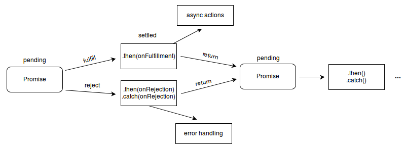

# 25_프로미스Promise

Created: Jul 2, 2020 2:21 PM

# 프로미스

자바스크립트 비동기 처리에 사용하는 객체이다. 

주로 서버에서 받아온 데이터를 화면에 표시할 때 사용한다. 요청을 보내고 데이터를 다 받아오기 전에 화면에 표시하면 오류가 발생하거나 빈 화면이 뜬다. 이런 문제를 해결하는 방법 중 하나이다.

프로미스를 사용하면 비동기 메서드에서 동기 메서드처럼 값을 반환할 수 있다. 반환값은 최종 결과가 아니고 프로미스, 즉 미래의 어떤 시점의 결과이다.

이런 식으로 프로미스는 연속적 비동기 함수에 명확성을 부여하고 입력과 출력을 명확히 해준다.



## 프로미스의 세 가지 상태States

`new Promise()` 로 프로미스를 생성하고 종료할 때까지 세 가지의 상태가 있다.

### Pending(대기)

비동기 처리 로직이 아직 완료되지 않은 상태이다.

`new Promise()` 메서드를 호출하면 대기 상태가 된다. 메서드를 호출할 때 콜백 함수를 선언할 수 있다.

```jsx
new Promise(function(resolve, reject) {
});
```

프로미스가 `resolved` 이거나 `rejected` 일 때 프로미스가 확정되었다고 한다.

프로미스의 실행, 거부는 영구적이다. 즉 한 번만 성공하거나 실패할 수 있다.

한 번 값이 설정되면 변경할 수 없다.

프로미스가 이미 실행되었다면 `then()` 으로 바로 성공 콜백을 호출할 수 있다.

### Fulfilled(이행)

== 완료

비동기 처리가 완료되어 프로미스가 결과 값을 반환해준 상태이다.

콜백 함수의 인자 `resolve` 를 실행하면 이행 상태가 된다.

이행 상태가 되면 `then()` 을 이용하여 결과 값을 받을 수 있다.

```jsx
function getDate() {
	return new Promise(function(resolve, reject) {
		var data = 100;
		resolve(data);
	});
}

// resolve()의 결과 값 data를 resolvedData로 받는다.
getData().then(function(resolvedData) {
	console.log(resolvedData);
});
```

### Rejected(실패)

비동기 처리가 실패하거나 오류가 발생한 상태이다.

`reject` 를 호출하면 실패 상태가 된다. 실패 처리의 결과값을 `catch()` 로 받을 수 있다.

```jsx
function getData() {
	return new Promise(function(resolve, reject) {
		reject(new Error("Request is failed"));
	});
}

// reject()의 결과 값 Error를 err에 받는다.
getData().then().catch(function(err) {
	console.log(err); // Error: Request is failed
});
```

## 프로미스 연결Promise Chaining

`then()` 으로 여러 개의 프로미스를 연결하여 사용할 수 있다.

`promise.all` 을 사용하면 너무 많은 API 검색 시 오류가 발생할 수 있다.

### 예제

```jsx
new Promise(function(resolve, reject) {
	setTimeout(function() {
		resolve(1);
	}, 2000);
})
.then(function(result) {
	console.log(result); // 1
	return result + 10;
})
.then(function(result) {
	console.log(result); // 11
	return result + 20;
})
.then(function(result) {
	console.log(result); // 31
});
```

### 예제2

```jsx
'use strict'
var promiseCount = 0;

function testPromise() {
	var thisPromiseCount = ++promiseCount;
	
	var log = document.getElementById('log');
	log.insertAdjacentHTML('beforeend', thisPromiseCount + ') 시작 (<small>동기적 코드 시작</small>)<br/>');
	
	// 새 프로미스 생성
	// 프로미스의 생성 순서를 전달하겠다는 약속(3초 기다린 후)
	var p1 = new Promise( 
		// 실행 함수는 프로미스를 이행(resolve)하거나
		// 거부(reject)할 수 있음
		fucntion(resolve, reject) {
			log.insertAdjacentHTML('beforeend', thisPromiseCount + ') 프로미스 시작 (<small>비동기적 코드 시작</small>)<br/>');
			// setTimeout은 비동기적 코드를 만드는 예제에 불과하다.
			window.setTimeout(
				function() {
					// 프로미스 이행
					resolve(thisPromiseCount);
				}, Math.random() * 2000 + 1000);
		}
	);
	
	// 프로미스를 이행했을 때 할 일은 then() 호출로 정의하고, 
	// 거부했을 때 할 일은 catch() 호출로 정의한다.
	p1.then(
		// 이행 값 기록
		function(val) {
			log.insertAdjacentHTML('beforeend', val + ') 프로미스 이행 (<small>비동기적 코드 종료</small>)<br/>');
		})
	.catch( 
		// 거부 이유 기록
		function(reason) {
			console.log('여기서 거부된 프로미스(' + reason + ')를 처리하세요/');
		});

	log.insertAdjacentHTML('beforeend', thisPromiseCount + ') 프로미스 생성 (<small>동기적 코드 종료</small>)<br/>');
}
```

### 에러 핸들링

프로미스의 에러 처리는 `catch()` 를 사용하는 편이 효율적이다.

```jsx
promise.then((result) => {
  console.log('Got data!', result);
}).then(undefined, (error) => {A
  console.log('Error occurred!', erroAr);
});
```

위의 코드 보다

```jsx
promise.then((result) => {
  console.log('Got data!', result);
}).catch((error) => {
  console.log('Error occurred!', error);
});
```

이렇게 하는 것이 좋다. 

`catch()` 는 프로미스 생성자 콜백에서 예외가 발생하면 호출된다. 로그 기록을 위해 `catch()` 를 사용한다.

참고

[https://developer.mozilla.org/ko/docs/Web/JavaScript/Reference/Global_Objects/Promise](https://developer.mozilla.org/ko/docs/Web/JavaScript/Reference/Global_Objects/Promise)

[https://poiemaweb.com/es6-promise](https://poiemaweb.com/es6-promise)

[https://joshua1988.github.io/web-development/javascript/promise-for-beginners/](https://joshua1988.github.io/web-development/javascript/promise-for-beginners/)