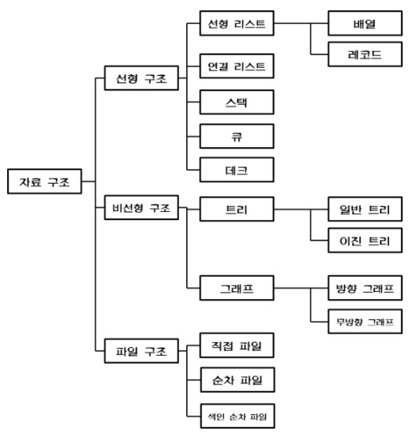

# 27_자료구조data structure

Created: Jul 6, 2020 11:45 AM

# 자바스크립트 자료 구조

**자료구조(Data-Structure)는 데이터들의 모임, 관계, 함수, 명령 등의 집합을 의미한다.**

더 쉽게 표현하자면, **1) 처리하고자 하는 데이터들이 모여 있는 형태 혹은 2) 처리하고자 하는 데이터들 사이의 관계(수직 관계, 상하 관계, 일방적인 관계, 상호 관계 등)를 정의한 것 혹은 3) 데이터들을 사용하기 용이하게 저장해 놓은 형태**라고 볼 수 있다.

자료구조를 잘 선택하면 사용하는 메모리를 최소화 할 수 있으며 시간, 공간적으로 효율성을 확보할 수 있다.

## Array

스택과 큐는 오직 아이템을 어떻게 삽입/삭제 하는가만 다른 **배열 같은** 자료구조이다.

### Stack

LIFO(Last In, First Out)

`push` , `pop`

`unshift` , `shift` 보다 성능이 좋다. (최상단 인덱스만 변하기 때문이다.)

```jsx
class Stack {
    constructor(...items) {
        this.reverse = false;
        this.stack = [...items];
    }

    push(...items) {
        return this.reverse ? this.stack.unshift(...items) : this.stack.push(...items);
    }

    pop(...items) {
        return this.reverse ? this.stack.shift() : this.stack.pop();
    }
}
```

### Queue

FIFO(First In, First Out)

`unshift` , `pop` ( `push`, `shift` )

→ enqueue, dequeue

자바스크립트 코드를 실행할 때 event queue를 사용하여 `listener` 를 등록(enqueue) 하고 event loop로 등록된 `event` 들을 listen 한다. 그리고 `listener function` 들은 콜스택이 비어있을 때만 제거(dequeue)되며 실행된다.

→ 큐는 대기 행렬 처리에 사용된다.

프로그래밍적으로 `Queue` 는 `unshift` 와 `pop` 두 개의 단순 작업으로 이루어진 배열이다.

```jsx
class Queue {
    constructor(...items) {
        this.reverse = false;
        this.queue = [...items];
    }

    enqueue(...items) {
        return this.reverse ? this.queue.push(...items) : this.queue.unshift(...items);
    }

    dequeue() {
        return this.reverse ? this.queue.shift() : this.queue.pop();
    }
}
```

**링크드 리스트**, **트리** 그리고 **그래프**는 다른 노드에 대한 참조를 유지하는 노드로 이루어진 구조체이다.

## Linked List

`Linked List` 는 배열같이 데이터들을 순차적으로 저장한다.

인덱스 대신 다른 원소를 가리키는 **포인터**를 가지고 있다.

→ 순서에 따라 노드의 포인터 부분을 이용해 서로 연결시킨다.

첫번째 노드는 `head` , 마지막 노드는 `tail` 이다.

노드의 삽입과 삭제가 용이하다. 포인터만 바꾸면 되기 때문이다.

탐색하는데 오래걸릴 수 있다.

스택이나 큐처럼 작동할 수 있다. 배열보다 성능이 좋다.

Redux 같은 상태관리 라이브러리들이 미들웨어 로직을 링크드 리스트로 구현한다.

## Tree

링크드 리스트와 유사하지만, 많은 child nodes 를 유지하고 있는 **계층적 구조**이다.

방향성이 있고, 부모와 자식 구조가 명확하다. 사이클을 이루지 않는다.

각 노드는 하나 이상의 부모를 가질 수 없다.

DOM 이 트리 구조이다. 

### 이진 탐색 트리

Binary Search Tree 는 각 노드가 두 개 이상의 자식을 가질 수 없다. 

left child 는 반드시 부모의 값보다 작거나 같아야 하고, right child 는 반드시 부모의 값보다 커야한다.

가장 왼쪽, 가장 오른쪽 노드가 각각 최소 혹은 최대값이 된다.

## Graph

트리의 부모가 하나보다 더 많이 가질 수 있다면, Graph 이다.

그래프에서 노드들을 이어주는 Edge 는 노드들이 방향, 무방향, 가중치, 비가중치를 가지게 한다.

vector 와 유사한 방향과 가중치를 가진다.

Mixin 형태의 다중 상속과 다대다 관계를 가진 데이터 객체는 그래프 구조이다.

그래프는 사이클을 이루도록 구성된다.

## Hash

해시 테이블은 **연관배열 구조를 이용하여 키(key)에 결과 값(value)을 저장하는 자료구조**이다.

자바스크립트 heap 이 해시 테이블을 사용하고 있다.

연관배열 구조(associative array)란,

키(key) 1개와 값(value) 1개가 1:1로 연관되어 있는 자료구조이다. 따라서 키(key)를 이용하여 값(value)을 도출할 수 있다.

(딕셔너리와 유사하다.)

해시 테이블은 키, 해시함수, 해시, 값, 저장소(Bucket, Slot)로 이루어져 있다.

키는 해시함수를 통해 해시로 변경이 되며 해시는 값과 매칭되어 저장소에 저장이 된다.

- 키 : 고유한 값이며, 해시 함수의 input이 된다. 다양한 길이의 값이 될 수 있다. 이 상태로 최종 저장소에 저장이 되면 다양한 길이 만큼의 저장소를 구성해 두어야 하기 때문에 해시 함수로 값을 바꾸어 저장이 되어야 공간의 효율성을 추구할 수 있다.
- 해시함수 : 키를 해시로 바꿔주는 역할을 한다. 다양한 길이를 가지고 있는 키를 일정한 길이를 가지는 해시로 변경하여 저장소를 효율적으로 운영할 수 있도록 도와준다. 다만, 서로 다른 키가 같은 해시가 되는 경우를 해시 충돌이라고 하는데, 해시 충돌을 일으키는 확률을 최대한 줄이는 함수를 만드는 것이 중요하다.
- 해시 : 해시 함수의 결과물이며, 저장소에서 값과 매칭되어 저장된다.
- 값 : 저장소에 최종적으로 저장되는 값으로 키와 매칭되어 저장, 삭제, 검색, 접근이 가능해야 한다.

### 해시 테이블의 단점

- 순서가 있는 배열에는 어울리지 않는다.: 상하관계가 있거나, 순서가 중요한 데이터의 경우 Hash Table은 어울리지 않다. 순서와 상관없이 key만을 가지고 hash를 찾아 저장하기 때문이다.
- 공간 효율성이 떨어진다.: 데이터가 저장되기 전에 미리 저장공간을 확보해 놓아야 한다. 공간이 부족하거나 아예 채워지지 않은 경우가 생길 가능성이 있다.
- Hash Function의 의존도가 높다.: 평균 데이터 처리의 시간복잡도는 O(1)이지만, 이는 해시 함수의 연산을 고려하지 않는 결과이다. 해시함수가 매우 복잡하다면 해시테이블의 모든 연산의 시간 효율성은 증가할 것이다.

`Stack` 과 `Queue` 는 가장 간단하며 `Linked List` 로 구성할 수 있다.

`Tree` 와 `Graph` 는 링크드 리스트의 개념을 확장시킨 것이기 때문에 가장 복잡하다.

`Hash Table` 은 이런 자료구조들을 활용하여 안정적으로 돌아가야 한다.

효율성 측면에서, 링크드 리스트는 데이터의 기록 및 저장에 가장 최적화되어 있으며 해시 테이블은 데이터의 탐색과 검색에 가장 효과적이다.



참고

[https://velog.io/@cyranocoding/Hash-Hashing-Hash-Table해시-해싱-해시테이블-자료구조의-이해-6ijyonph6o](https://velog.io/@cyranocoding/Hash-Hashing-Hash-Table%ED%95%B4%EC%8B%9C-%ED%95%B4%EC%8B%B1-%ED%95%B4%EC%8B%9C%ED%85%8C%EC%9D%B4%EB%B8%94-%EC%9E%90%EB%A3%8C%EA%B5%AC%EC%A1%B0%EC%9D%98-%EC%9D%B4%ED%95%B4-6ijyonph6o)

[https://1ilsang.dev/2019-09-15/cs/data-structure-in-js](https://1ilsang.dev/2019-09-15/cs/data-structure-in-js)

[https://server-engineer.tistory.com/130](https://server-engineer.tistory.com/130)