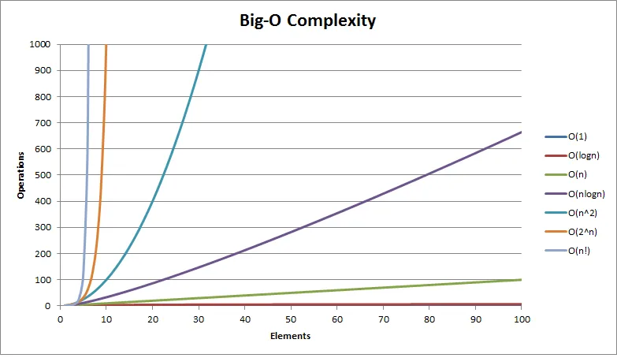
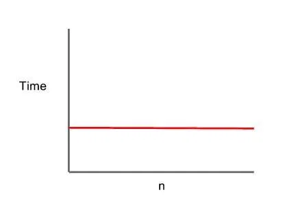
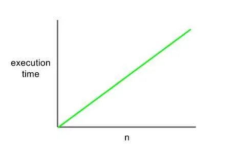
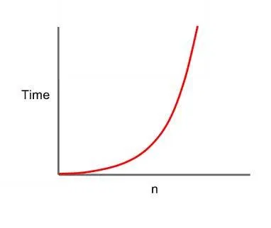
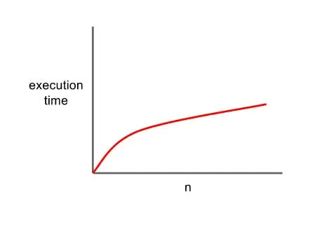

# 28_함수 성능과 빅 오(Big O) 표기법

Created: Jul 7, 2020 9:45 PM

# 빅 오Big O

빅 오 표기법은 입력 시간에 따라 알고리즘이 실행되는 데 걸리는 시간을 수학적으로 표현한 것이다.

보통 최악의 경우를 이야기한다.

빅 오를 알면 알고리즘의 효율성을 인지하고 성능이 좋은 애플리케이션을 만드는 데 도움이 된다.

## 빅 오를 결정하는 방법

1. 입력 결정
2. 각 줄, 입력이 어떻게 사용되는지 평가

    한 줄 한 줄의 시간복잡성을 어떻게 나타낼 수 있는지..

3. 상수 삭제
4. 가장 중요한 표기법 찾기

    가장 최악의 시나리오를 찾는다. O(n + n²) 라면 O(n²) 가 된다.

## O(1)

상수 시간. constant time.

복잡성(항목 수)에 관계없이 시간이 일정하다.

타입 또는 길이에 관계없이 이미 알고 있는 배열 위치에서 요소를 반환하는 알고리즘에서 볼 수 있다.

## O(n)

선형 시간.  

최악의 경우 시간은 항목 수와 함께 증가한다.

즉, N 요소의 경우 N 번의 반복이 필요하다.

## O(n²)

2차 시간.

최악의 경우 입력 수의 제곱이다.

입력 수와 관련하여 기하급수적으로 증가한다.

내부 루프가 외부 루프 실행시마다 n번 실행되는 `for` 루프가 해당된다.

## O(2^n)

지수 시간.

일반적으로 그 정도를 모르고 가능한 모든 조합 또는 순열을 시도해야 하는 상황이다.

브루트 포스 탐색을 통한 연쇄 행렬 곱셈이 예이다.

## O(log n)

search/sort 알고리즘의 기본이며, 대규모 수집을 처리할 때 가장 효율적이다.

데이터를 분할하면서 반복한다. 반복할때마다 입력의 절반이 된다.

이진 탐색이 대표적이다.

작은 배열에서는 오히려 불필요한 오버헤드가 발생할 수 있다.

### O(n log n)

퀵 정렬, 병합 정렬이 가장 널리 사용되는 알고리즘이다.

참고

[https://ko.wikipedia.org/wiki/시간_복잡도](https://ko.wikipedia.org/wiki/%EC%8B%9C%EA%B0%84_%EB%B3%B5%EC%9E%A1%EB%8F%84)