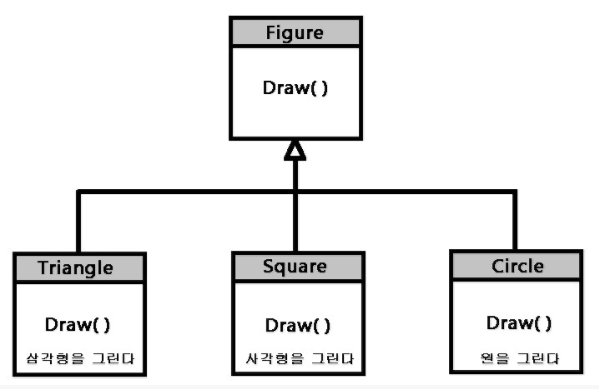

# 30_상속, 다형성, 코드의 재사용성

Created: Jul 9, 2020 11:32 PM

## 클래스 상속

### 상속이란?

부모 클래스의 속성과 메서드를 자식 클래스가 물려받는 것.

상속을 받은 자식 클래스는 부모 클래스의 속성과 메서드 외에 필요한 기능을 확장해서 사용할 수 있다.

코드를 재사용하고, 중복 코드를 제거할 수 있다.

### extends

```jsx
class ChildClass extends ParentClass { ... }
```

확장(클래스)의 `.prototype` 은 `Object` 또는 `null` 이어야 한다.

`null` 확장도 보통 클래스처럼 동작한다.

```jsx
class nullExtends extends null {
  constructor() {}
}

Object.getPrototypeOf(nullExtends); // Function.prototype
Object.getPrototypeOf(nullExtends.prototype) // null
```

`extends` 키워드는 `ChildClass.prototype.[[Prototype]]` 을 `ParentClass.prototype` 으로 설정한다.

뒤에 어떤 표현이 와도 상관없다.

```jsx
function f(phrase) {
return class {
   sayHi() { alert(phrase) }
 }
}

class User extends f("Hello") {}
// f("Hello") 결과를 상속받는다.

new User().sayHi(); // Hello
```

### 메서드 오버라이딩

기본적으로 자식 클래스의 메서드는 부모 클래스에서 그대로 가져온다.

그러나 자식 클래스에서 자체 메서드를 지정해서 사용할 수 있다.

오버라이딩은 부모 메서드를 완전히 대체한다기보다 기능을 조정 또는 확장할 때 사용한다.

`super.method()` 로 부모 메서드를 호출할 수 있다. (화살표 함수는 `super` 가 없다.)

### 생성자 오버라이딩

클래스가 다른 클래스를 확장하고 `constuctor` 가 없는 경우

```jsx
class ChildClass extends ParentClass {
	constuctor(...args) {
		super(...args);
	}
}
```

빈 `constuctor` 가 생성된다. 

모든 인수를 전달하면서 부모 클래스의 `constuctor` 를 호출한다. 

부모 클래스의 인수를 `super()` 로 호출하지 않으면 `this` 에 대한 객체가 생성되지 않는다.

```jsx
class ChildClass extends ParentClass {
	constuctor(arg1, arg2) {
		super(arg1);
		this.args2 = arg2
	}
}
```

### `[[HomeObject]]`

`[[HomeObject]]` 는 함수 내부 속성이다. 상위 프로토타입을 연결할 수 있다.

클래스문에서 메소드가 정의되는 시점에 확정되고 변경할 수 없다.

`super` 는 `[[HomeObject]]` 를 통해 부모의 프로토타입과 메서드를 찾는 것이다.

```jsx
let animal = {
  name: "Animal",
  eat() {         // animal.eat.[[HomeObject]] == animal
    alert(`${this.name} eats.`);
  }
};

let rabbit = {
  __proto__: animal,
  name: "Rabbit",
  eat() {         // rabbit.eat.[[HomeObject]] == rabbit
    super.eat();
  }
};

let longEar = {
  __proto__: rabbit,
  name: "Long Ear",
  eat() {         // longEar.eat.[[HomeObject]] == longEar
    super.eat();
  }
};

// works correctly
longEar.eat();  // Long Ear eats.
```

`super` 를 사용한 메서드는 `[[HomeObject]]` 를 변경할 수 없으므로 바인딩이 계속 지속된다.

메서드를 함수 형태로 `method: function()` 만들면 `[[HomeObject]]` 속성이 설정되지 않는다.

메서드는 `method()` 로 정확히 지정해야 한다.

### 프로토타입 복제

프로토타입을 복제함으로써 부모를 상속받는 자식 객체를 만들 수 있다.

```jsx
child.prototype = Object.create(parent.prototype);
SubType.prototype = new SuperType();
```

자식 객체에서 부모의 프로토타입 속성을 수정하면 다른 자식들도 영향을 받는다.

그러므로 생성자를 사용하여 인스턴스 속성을 상속해야 한다.

### 보안 문제

클래스의 메서드 자체를 생성자에서 저장하고 클로저로 사용하여 외부에서의 접근을 막을 수 있다.

`WeakMap` 역시 프라이빗 객체 속성을 키/값으로 클로저로 만들 수 있다.

### 주의할 점

상속을 받는다 == 데이터를 직접 조작할 수 있는 함수가 늘어난다.

상속이 너무 많으면 캡슐화가 되지 않고, 수정하기 어렵고, 재사용하기 어려워진다.

하나의 개념을 구현하는 최소한의 클래스를 디자인해야 한다.

- 클래스 생성자는 함수 호출할 수 없다.
- 클래스 생성자의 프로토타입 속성을 다시 할당할 수 없다.
- 클래스 메서드에는 프로토타입 속성이 없다.

### 참고

- 프록시

    `Proxy` 객체는 기본적인 동작(속성 접근, 할당, 순회, 열거, 함수 호출 등)의 새로운 행동을 정의할 때 사용한다.

    내부적으로 실제의 객체(real subject)에 접근할 때 호출되는 래퍼(wrapper) 혹은 대리 객체다.

    ```jsx
    new Proxy(target, handler);
    ```

    `target` : 프록시와 함께 감싸진 타겟 객체 (native array, function, 다른 proxy를 포함한 객체)

    `handler` : 프로퍼티들의 함수인 객체이다. 동작이 수행될 때, 핸들러는 프록시의 행동을 정의한다.

    ```jsx
    var handler = {
        get: function(target, name){
            return name in target?
                target[name] :
                37;
        }
    };

    var p = new Proxy({}, handler);
    p.a = 1;
    p.b = undefined;

    console.log(p.a, p.b); // 1, undefined
    console.log('c' in p, p.c); // false, 37
    ```

- 클래스 팩토리

    객체를 반환하는 함수

## 다형성

### 다형성이란?

특정 기능을 선언(설계) 부분과 구현(동작) 부분으로 분리한 후 **구현** 부분을 다양한 방법으로 만들어 선택할 수 있게 하는 기능이다. 객체지향 프로그래밍에서 핵심적인 기능이다.

예를 들어 다양한 도형을 그릴 때 인터페이스나 추상 클래스에 `Draw()` 라는 메서드를 선언해놓고, `Triangle`, `Square`, `Circle` 클래스에서 상속을 받아 해당 클래스에 맞게 기능을 구현할 수 있다.



### 자바스크립트에서 다형성

자바스크립트는 데이터 타입을 명시하지 않고 선언한다. 인터페이스, 추상 클래스 등에서 다형성과 관련된 문법도 없다. 자바스크립트에서 다형성은 그냥 지원한다고 생각하고 규칙에 맞춰 구현하는 수 밖에 없다.

------

참고

클래스, 상속, 팩토리

[https://webclub.tistory.com/406](https://webclub.tistory.com/406)

[https://debugdaldal.tistory.com/151?category=927008](https://debugdaldal.tistory.com/151?category=927008)

[https://developer.mozilla.org/ko/docs/Web/JavaScript/Reference/Classes/extends](https://developer.mozilla.org/ko/docs/Web/JavaScript/Reference/Classes/extends)

[https://velog.io/@kyujonglee/Javascript-class-설탕문법](https://velog.io/@kyujonglee/Javascript-class-%EC%84%A4%ED%83%95%EB%AC%B8%EB%B2%95)

[https://ui.toast.com/weekly-pick/ko_20160905/](https://ui.toast.com/weekly-pick/ko_20160905/)

프록시

[https://hyunseob.github.io/2016/08/17/javascript-proxy/](https://hyunseob.github.io/2016/08/17/javascript-proxy/)

[https://developer.mozilla.org/ko/docs/Web/JavaScript/Reference/Global_Objects/Proxy](https://developer.mozilla.org/ko/docs/Web/JavaScript/Reference/Global_Objects/Proxy)