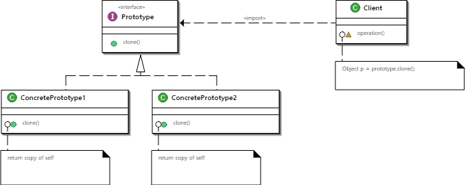
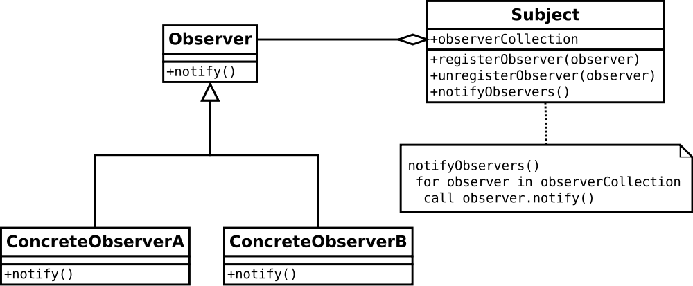

# 31_설계 패턴

Created: Jul 11, 2020 12:51 AM

# 자바스크립트 디자인 패턴

### 디자인 패턴에서 고려할 사항

1. Context: 어떤 상황에서 사용되는가?
2. Problem: 무엇을 해결하려 하는가?
3. Solution: 이 패턴을 사용해서 문제를 어떻게 해결하는가?
4. Implementation: 구현된 코드는 어떠한가?

## 생성자Constuctor, 프로토타입Prototype

다른 프로세스에서 객체를 사용하는 경우 이전에 만든 객체를 복제(얕은 복사)해서 사용한다.



클래스 기반의 디자인 패턴. 

함수로 정의된 메서드 및 속성으로 새 객체를 인스턴스화 한다.

- Object Creation

    ```jsx
    var newObject = {};
    var newObject = Object.create(Object.prototype);
    var newObject = new Object;
    ```

- Basic Constructors

    함수 내부에서 `this` 로 속성과 메서드를 정의

- Constuctor with prototypes

    `.prototype` 으로 메서드를 정의 == 고유한 프로토타입 설정

### Revealing Prototype Pattern

객체 리터럴을 반환하여 캡슐화할 수 있다.

```jsx
var TeslaModelS = function() {
  this.numWheels    = 4;
  this.manufacturer = 'Tesla';
  this.make         = 'Model S';
}

TeslaModelS.prototype = function() {

  var go = function() {
    // Rotate wheels
  };

  var stop = function() {
    // Apply brake pads
  };

  return {
    pressBrakePedal: stop,
    pressGasPedal: go
  }

}();
```

### 팩토리 패턴

또 다른 클래스 기반의 생성 패턴이다. 

객체 인스턴스화의 책임을 하위 클래스에 위임하는 범용 인터페이스를 제공한다.

서로 다르지만 비슷한 특성을 가진 많은 개체 컬렉션을 관리하거나 조작해야 할 때 사용한다.

매개변수를 취하는 메서드를 가진 팩토리 클래스를 만들고, 매개변수에 따라 객체 인스턴스화 책임을 각 클래스의 위임한다.

```jsx
class BallFactory {
  constructor() {
    this.createBall = function(type) {
      let ball;
      if (type === 'football' || type === 'soccer') ball = new Football();
      else if (type === 'basketball') ball = new Basketball();
      ball.roll = function() {
        return `The ${this._type} is rolling.`;
      };

      return ball;
    };
  }
}

class Football {
  constructor() {
    this._type = 'football';
    this.kick = function() {
      return 'You kicked the football.';
    };
  }
}

class Basketball {
  constructor() {
    this._type = 'basketball';
    this.bounce = function() {
      return 'You bounced the basketball.';
    };
  }
}
```

## 모듈Module

자바스크립트 모듈은 특정 컴포넌트의 코드를 다른 구성 요소와 **독립적으로 유지**하기 위해 사용되는 디자인 패턴이다.

변수 값을 **외부에 노출하지 않고** 특정 메서드를 통해서만 변수 값에 접근할 수 있도록 한다.

자바의 `private` , `public` 을 모듈 패턴으로 구현할 수 있다.

### 모듈화의 장점

- 자주 사용되는 코드를 별도의 파일로 만들어서 필요할 때마다 활용할 수 있다.
- 코드를 개선하면 이를 사용하고 있는 모든 애플리케이션의 동작이 개선된다.
- 코드 수정 시에 필요한 로직을 빠르게 찾을 수 있다.
- 필요한 로직만을 로드해서 메모리의 낭비를 줄일 수 있다.
- 한번 다운로드된 모듈은 웹브라우저에 의해서 저장되기 때문에 동일한 로직을 로드할 때 시간과 네트워크 트래픽을 절약할 수 있다.(브라우저에서만 해당)

### IIFE

주로 모듈 패턴은 IIFE 와 같이 사용된다.

외부에서 접근이 불가능한 독립적인 스코프를 가지고 있다.

스코프가 겹치지 않기 때문에 같은 이름의 변수가 존재하더라도 외부 스코프와 충돌할 문제가 없다. 

클로저를 이용해 private 한 변수나 함수를 만들 수도 있다.

```jsx
var stories = 'Medium Story';
var medium = (function() {
  var stories = ['🍔', '🍟', '🍕'];
  return { getStories: stories };
})();

console.log(stories); // Medium Story
console.log(medium.getStories()); // ['🍔', '🍟', '🍕']
console.log(medium.stories); // undefined
```

### 클로저

```jsx
var module = (function() {

    /*
    * -----------------------
    * 모듈 패턴을 구현할 클로저 코드
    * -----------------------
    */

    // 은닉될 멤버 정의
    var privateKey = 0;
    function privateMethod() {
        return privateKey++;
    }

    // 공개될 멤버(특권 메소드) 정의
    return {
        publicKey: privateKey,
        publicMethod: function() {
            return privateMethod();
        }
    }

})()

console.log(module.publicMethod()); // 0
console.log(module.publicMethod()); // 1
```

모듈 패턴의 반환값은 **객체**이다. 익명함수가 자동으로 실해되고 반환된 객체를 `module` 변수에 할당한다. 자동으로 호출되는 점을 제외하고 클로저와 유사하게 작동한다.

인스턴스를 여러 개 만들어낼 수 있다는 점에서 싱글톤 패턴과도 차이가 있다.

### 객체 리터럴

객체 리터럴은 모듈 패턴이기도 하며, 하나의 객체라는 점에서 싱글톤 패턴이라고도 할 수 있다.

하지만 모든 속성이 공개되어 있기 때문에 클로저를 이용해야 한다.

독립된 모듈은 자체적으로 필요한 내부 변수 및 내부 함수를 모두 가지고 있어야 하기 때문이다.

```jsx
var module = {
    key: 'data',
    publicMethod: function() {
        return this.key;
    }
}

console.log(module.key); // data
console.log(module.publicMethod()); // data
```

### Revealing Module Pattern

모듈 노출 패턴은 프로토타입 노출 패턴과의 차이를 모르겠다.

기능에 대한 포인터가 있는 익명 객체를 반환한다.

## 옵저버Observer

이벤트가 발생했을 때 함수가 실행되도록 한다. 한 부분이 변경되면 다른 부분도 업데이트 해야 하기 때문이다.



`subject` 는 모든 변경을 알리기 위한 `observer` 에 대한 객체를 참조한다. 

옵저버 객체는 구체적인 옵저버가 이벤트를 수신하도록 한다.

### Publish&Subscribe

알림을 수신하려는 객체==subscribers==관찰자 와 이벤트를 발생시키는 객체==publisher==주제  사이에 있는 이벤트 채널을 사용한다.

subscriber가 publisher을 통해 브로드 캐스트 한 토픽의 알림을 등록하고, 수신하기 위해 적절한 이벤트 핸들러를 구현한다.

하나의 객체(publisher)가 상태를 변경할 때 다른 모든 종속 개체(subscribers)에게 자동으로 알리고 업데이트 되도록 객체 간의 일대다 종속성을 정의한다.

## 싱글톤Singleton

하나의 클래스의 인스턴스가 하나만 필요할 때 사용한다.

싱글톤 객체는 정의한 즉시 실행시키고 인스턴스를 저장한다. 그리고 요청이 있을 때마다 해상 인스턴스를 반환한다.

인스턴스가 없으면 새 인스턴스가 만들어지고 반환되지만 이미 존재하면 기존 인스턴스에 대한 참조를 반환한다.

```jsx
var GlobalConfigurationObject = (function() { 		
	var instance; 
	function createInstance() { 
		return  new ConfigObject(); 
	}; 
	var getInstance = function() { 
		if (!instance) { 
			instance = createInstance(); 
		} 
		return instance; 
	} 
	return { getInstance: getInstance } 
})();
```

## 어댑터Adapter

하나의 인터페이스에서 다른 인터페이스로의 추상화 또는 중간개체이다. 

한 클래스의 인터페이스가 다른 클래스의 인터페이스로 변환된다.

이 패턴을 사용하면 호환되지 않는 인터페이스 때문에 다른 방법으로는 불가능했던 클래스가 함께 작동하도록 한다.

기존의 다른 오래된 API가 여전히 작동 할 수 있도록, 새로운 리팩토링 된 API에 대한 wrapper를 작성하는 데 사용된다.

## 명령Command

메서드 호출 , 요청 또는 오퍼레이션을 단일 오브젝트로 캡슐화한다.

실행할 수 있는 메서드 호출을 매개 변수화하고 전달할 수 있으며, 액션을 구현하는 객체에서 액션을 호출하는 객체를 분리하여 구체적인 클래스를 교체할 때 유연성을 향상시킨다.

명령은 독립적이기 때문에 새로운 명령을 추가할 수 있다.

잘못된 명령을 되돌리는 메서드도 추가할 수 있다.

== 작업을 다시 실행하거나 실행 취소하도록 추적할 수 있는 캡슐화된 작업이다.

------

참고

[https://velog.io/@recordboy/자바스크립트-모듈-패턴](https://velog.io/@recordboy/%EC%9E%90%EB%B0%94%EC%8A%A4%ED%81%AC%EB%A6%BD%ED%8A%B8-%EB%AA%A8%EB%93%88-%ED%8C%A8%ED%84%B4)

[https://webcoding.tistory.com/entry/JavaScript-자바스크립트-모듈-패턴을-이용한-캡슐화](https://webcoding.tistory.com/entry/JavaScript-%EC%9E%90%EB%B0%94%EC%8A%A4%ED%81%AC%EB%A6%BD%ED%8A%B8-%EB%AA%A8%EB%93%88-%ED%8C%A8%ED%84%B4%EC%9D%84-%EC%9D%B4%EC%9A%A9%ED%95%9C-%EC%BA%A1%EC%8A%90%ED%99%94)

[https://medium.com/오늘의-프로그래밍/자바스크립트-디자인-패턴-모듈-패턴-d5ba2c94eeb5](https://medium.com/%EC%98%A4%EB%8A%98%EC%9D%98-%ED%94%84%EB%A1%9C%EA%B7%B8%EB%9E%98%EB%B0%8D/%EC%9E%90%EB%B0%94%EC%8A%A4%ED%81%AC%EB%A6%BD%ED%8A%B8-%EB%94%94%EC%9E%90%EC%9D%B8-%ED%8C%A8%ED%84%B4-%EB%AA%A8%EB%93%88-%ED%8C%A8%ED%84%B4-d5ba2c94eeb5)

[https://www.zerocho.com/category/JavaScript/post/5800b4831dfb250015c38db5](https://www.zerocho.com/category/JavaScript/post/5800b4831dfb250015c38db5)

[https://www.zerocho.com/category/JavaScript/post/57c667f2ee0b9e9043fed696](https://www.zerocho.com/category/JavaScript/post/57c667f2ee0b9e9043fed696)