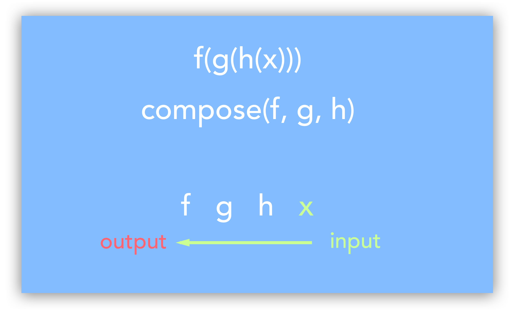
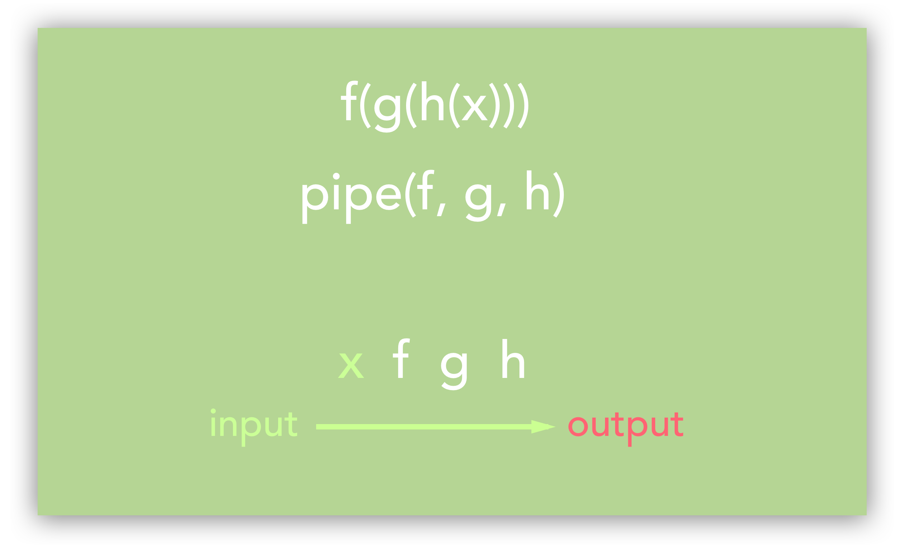

# 32_부분 어플리케이션, 커링(Currying), Compose, Pipe

Created: Jul 12, 2020 10:46 PM

## 부분 어플리케이션

여러 개의 인자를 받는 함수가 있을 때 일부의 인자를 고정한 함수를 만드는 기법.

부분만 사용한 함수는 함수가 실행되기 전에 미리 인자를 지정할 수 있다.

```jsx
var plus = function(a, b, c) {
  return a + b + c;
};

Function.prototype.partial = function() {
  var args = [].slice.apply(arguments);
  var self = this;
  return function() {
    return self.apply(null, args.concat([].slice.apply(arguments)));
  };
};

var plusa = plus.partial(1);
plusa(2, 3); // 6
var plusb = plusa.partial(2);
plusb(4); // 7
var plusab = plus.partial(1, 3);
plusab(5); // 9
```

일부 인자만 받은 새로운 함수를 만들고, 나중에 새로운 함수에 인자를 넣어 완성한다.

```jsx
var plusa = plus.bind(null, 1);
plusa(2, 3); // 6
var plusb = plusa.bind(null, 2);
plusb(4); // 7
var plusab = plus.bind(null, 1, 3);
plusab(5); // 9
```

`bind` 를 사용해서도 만들 수 있다.

즉, 여러 개의 인자를 받는 함수에서 몇개만 받아서 미리 값을 계산해 놓을 수 있는 함수를 만든다.

→ 상태를 기억하기 위해 **클로저**를 사용한다.

나중에 이 함수에 나머지 인자를 추가해서 최종 결과값을 얻는다.

✔ 또 다른 예시

```jsx
Function.prototype.partial = function (){
  var fn = this, args = Array.prototype.slice.call(arguments);
  return function(){
    var arg = 0;
    for ( var i = 0; i < args.length && arg < arguments.length; i++)
      if ( args[i] === undefined )
        args[i] = arguments[arg++];
    return fn.apply(this, args);
  }
}

var delay = setTimeout.partial(undefined, 10);
delay(function(){
  alert( "A call to this function will be temporarily delayed." );
});

var bindClick = document.body.addEventListener
                  .partial('click', undefined, false);

bindClick(function() {
  alert( "Click event bound via curried function." );
});
```

미리 입력하고 싶지 않은 인수에 대해 `undefined` 를 입력할 수도 있다.

라이브러리에서 이벤트를 연결하기 위해 사용하는 간단한 헬퍼 메서드로 사용할 수 있다. 

단순한 API 를 제공함으로써 최종 사용자가 불필요한 인수로 인해 번거롭게 되는 경우와 단일 함수를 호출하는 횟수를 줄일 수 있다. 

`bind` 보다 lodash 같은 라이브러리를 사용하면 훨씬 더 좋은 partial 함수를 사용할 수 있다.

## 커링

여러 개의 인자를 가진 함수를 호출 할 경우, 파라미터의 수보다 적은 수의 파라미터를 인자로 받으면 누락된 파라미터를 인자로 받는 기법. 즉 커링은 함수 하나가 n개의 인자를 받는 과정을 n개의 함수로 각각의 인자를 받도록 하는 것이다. 부분적으로 적용된 함수를 체인으로 계속 생성해 결과적으로 값을 처리하도록 하는 것이 그 본질이다.

커링은 모든 인수가 적용될 때까지 항상 하나의 인수로 다른 함수를 반환한다. 함수 체인은 모든 인수를 다 사용하고 최종값이 반환될 때까지 호출된다.

```jsx
var greetCurried = function(greeting) {
  return function(name) {
    console.log(greeting + ", " + name);
  };
};

var greetHello = greetCurried("Hello");
greetHello("Heidi"); //"Hello, Heidi"
greetHello("Eddie"); //"Hello, Eddie"

greetCurried("Hi there")("Howard"); //"Hi there, Howard"
```

여러 개의 인자를 사용하는 함수에서도 쓸 수 있다.

```jsx
var greetDeeplyCurried = function(greeting) {
  return function(separator) {
    return function(emphasis) {
      return function(name) {
        console.log(greeting + separator + name + emphasis);
      };
    };
  };
};

var greetAwkwardly = greetDeeplyCurried("Hello")("...")("?");
greetAwkwardly("Heidi"); //"Hello...Heidi?"
greetAwkwardly("Eddie"); //"Hello...Eddie?"

var sayHello = greetDeeplyCurried("Hello")(", ");
sayHello(".")("Heidi"); //"Hello, Heidi."
sayHello(".")("Eddie"); //"Hello, Eddie."

var askHello = sayHello("?");
askHello("Heidi"); //"Hello, Heidi?"
askHello("Eddie"); //"Hello, Eddie?"
```

파라미터 일부를 적용하여 새로운 함수를 동적으로 생성하면, 이 동적 생성된 함수는 반복적으로 사용되는 파라미터를 내부적으로 저장한다. (클로저이기 때문) 매번 인자를 전달하지 않아도 기능을 채워넣을 수 있다.

하지만 함수를 중첩하면 코드가 지저분해지기 때문에, 커링 함수로 함수의 이름과 인자만 가지고 사용할 수 있게 만든다.

```jsx
var curryIt = function(uncurried) {
  var parameters = Array.prototype.slice.call(arguments, 1);
  return function() {
    return uncurried.apply(this, parameters.concat(
      Array.prototype.slice.call(arguments, 0)
    ));
  };
};
```

`slice` 메서드로 인자들의 사본을 만들어둔다.

그리고 커링 함수의 `()` 내 함수 이름과 인자를 차례로 넣어 선언한다.

빠진 인자는 재선언하여 출력할 수 있다.

```jsx
var greeter = function(greeting, separator, emphasis, name) {
  console.log(greeting + separator + name + emphasis);
};

var greetHello = curryIt(greeter, "Hello", ", ", ".");
greetHello("Heidi"); //"Hello, Heidi."
greetHello("Eddie"); //"Hello, Eddie."

var greetGoodbye = curryIt(greeter, "Goodbye", ", ");
greetGoodbye(".", "Joe"); //"Goodbye, Joe."
```

커링 함수가 반환하는 값은 항상 단항이다. 

커링을 잘 사용하려면 Ramda나 lodash 같은 라이브러리를 사용하는 편이 더 좋다.

일관된 네이밍 규칙을 적용해서 코드 가독성을 높여야 한다. 

또한 함수에서 파생된 또 다른 함수들은 작동방식이 명확해야 하며, 어떤 인자가 들어오는지 알 수 있어야 한다.

### 커링과 부분 어플리케이션의 차이

- 커링은 항상 단항(1차) 기능이다. 변환된 함수는 원본과 동일한 개수의 인자가 필요하다.
- 부분 어플리케이션은 임의의 수의 인수 함수를 생성한다. 변환된 함수는 원래 함수보다 인자가 적다.
- 부분 어플리케이션을 사용하여 커링을 구현할 수 있다.

    그러나 여러 개의 인수를 취하는 함수를 커링할 수는 없다.

## Compose

함수 컴포지션은 여러 간단한 함수를 결합하여 더 복잡한 함수를 만드는 메커니즘이다.

✔ 간단한 `composed` 예제

```jsx
const compose = (...functions) => 
	(arg) => 
		functions.reduceRight(
			(composed, f) => f(composed), 
			arg
		);
```

`compose` 는 다른 함수를 반환하는 고차 함수이다.

여러 함수를 인수로 취해서 전개연산자 `...` 를 사용해 함수들을 배열로 변환한다.

그리고 `arg` 라는 인자를 받는 함수를 반환한다.

반환된 화살표 함수에 나중에 누군가 인자를 전달해 호출하면 함수 배열에 `reduce` 가 호출되면서 `arg` 로 받은 값이 전달된다. `arg` 값은 `reduceRight` 의 초기값이 되고 각 이터레이션 마다 배열의 각 원소(함수)와 이전 값을 변환 함수를 사용해 축약한 값을 전달한다. 이때 `reduce` 의 변환 함수는 이전 이터레이션의 결과값인 `composed` 와 `f` 를 인자로 받아서 `f` 에 `composed` 를 적용해 반환한다. 결국 마지막 함수가 호출되며 최종 결과를 반환한다.



함수 컴포지션을 사용하면 각각의 케이스를 하드코딩 하지 않고도 기본함수를 재사용할 수 있다.

또한, 자바스크립트의 함수가 일등객체이며 변수에 할당될 수 있기 때문에 boolean 조건을 기반으로 기능을 구성할 수 있다는 장점도 있다.

## Pipe

`compose` 와 `pipe` 의 차이는 컴포지션 순서이다.

```jsx
const compose = (...functions) => 
	(arg) => 
		functions.reduce(
			(composed, f) => f(composed),
			arg
		);
```

`pipe` 는 왼쪽에서 오른쪽으로 함수 컴포지션을 수행한다.



`compose` 와 `pipe` 둘 다 `Ramda.compose()` & `Ramda.pipe()` 를 사용할 수 있다.

`Ramda.pCompose` 와 `Ramda.pPipe` 는 프로미스를 받는다.

---

참고

[https://edykim.com/ko/post/javascript-partial-application/](https://edykim.com/ko/post/javascript-partial-application/)

[https://www.zerocho.com/category/JavaScript/post/579236d08241b6f43951af18](https://www.zerocho.com/category/JavaScript/post/579236d08241b6f43951af18)

[https://sujinlee.me/currying-in-functional-javascript/](https://sujinlee.me/currying-in-functional-javascript/)

[https://medium.com/오늘의-프로그래밍/함수형-프로그래밍-pipe-c80dc7b389de](https://medium.com/%EC%98%A4%EB%8A%98%EC%9D%98-%ED%94%84%EB%A1%9C%EA%B7%B8%EB%9E%98%EB%B0%8D/%ED%95%A8%EC%88%98%ED%98%95-%ED%94%84%EB%A1%9C%EA%B7%B8%EB%9E%98%EB%B0%8D-pipe-c80dc7b389de)

[https://medium.com/@wjdwlgus11/자바스크립트-compose와-pipe-9644668d16aa](https://medium.com/@wjdwlgus11/%EC%9E%90%EB%B0%94%EC%8A%A4%ED%81%AC%EB%A6%BD%ED%8A%B8-compose%EC%99%80-pipe-9644668d16aa)