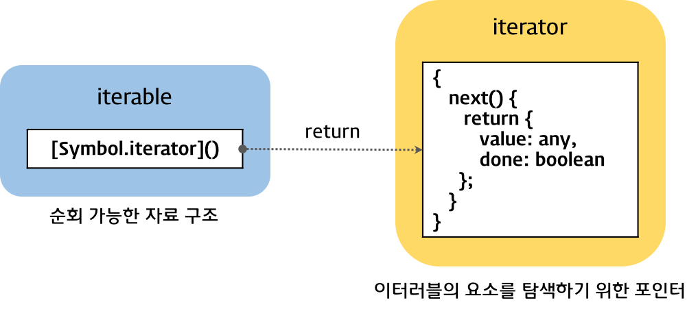
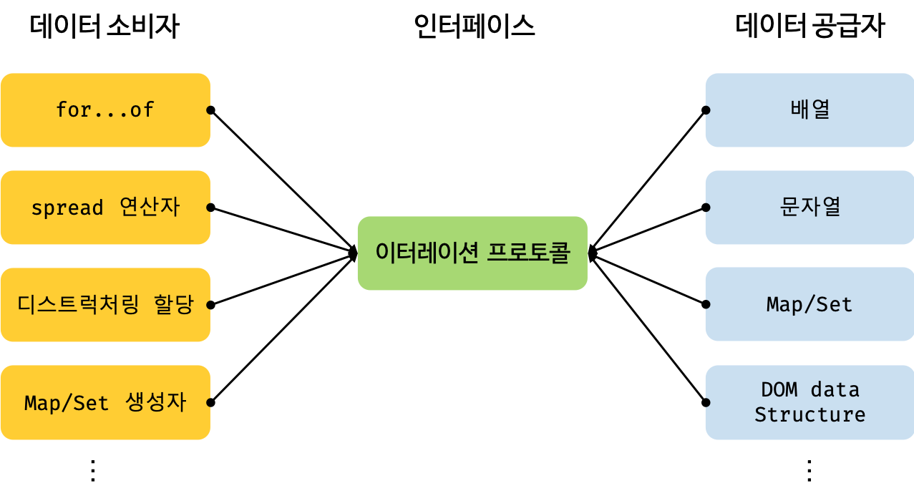

# 34_Iterator, Generator

Created: Jul 15, 2020 2:02 AM

## Iterator

이터레이션 프로토콜은 데이터 컬렉션을 순회하기 위한 프로토콜이다.

이터레이션 프로토콜을 준수한 객체는 `for...of` 문으로 순회할 수 있고, 전개 연산자의 피연산자가 될 수 있다.

이터러블 프로토콜에는 이터러블과 이터레이터 두 가지 형태가 있다.



### 이터러블

이터러블은 객체의 멤버를 반복할 수 있는 객체이다.

이터러블한 객체는 객체 속성에 `Symbol.iterator` 메서드가 있어야 한다. (구현하거나 프로토타입 체인으로 상속하거나)

→ `Symbol.iterator` 는 주어진 객체의 이터레이터를 반환한다.

객체는 반드시 하나의 `Symbol.iterator` 만을 가질 수 있다.

자바스크립트의 빌트인 객체 중 이터러블한 객체는 `Array` , `TypedArray` , `String` , `Map` , `Set` 등이 있다.

> Array, String, Map, Set, TypedArray(Int8Array, Uint8Array, Uint8ClampedArray, Int16Array, Uint16Array, Int32Array, Uint32Array, Float32Array, Float64Array), DOM data structure(NodeList, HTMLCollection), Arguments

```jsx
const array = [1, 2, 3];

// 배열은 Symbol.iterator 메소드를 소유한다.
// 따라서 배열은 이터러블 프로토콜을 준수한 이터러블이다.
console.log(Symbol.iterator in array); // true

// 이터러블 프로토콜을 준수한 배열은 for...of 문에서 순회 가능하다.
for (const item of array) {
  console.log(item);
}

// 일반 객체에는 Symbol.iterator 메서드가 없다.
const obj = { a: 1, b: 2 };

// 일반 객체는 이터러블 프로토콜을 준수한 이터러블이 아니다.
console.log(Symbol.iterator in obj); // false

// 이터러블이 아닌 일반 객체는 for...of 문에서 순회할 수 없다.
// TypeError: obj is not iterable
for (const p of obj) {
  console.log(p);
}
```

### 이터레이터

이터레이터는 반복을 위해 설계된, 특별한 인터페이스를 가진 객체이다.

이터레이터 객체는 `next()` 를 가진다. `next()` 메서드로 순환할 수 있다.

→ 연산의 결과로 객체를 반환한다. 

`next` 메서드에는 규칙이 있다.

- `next` 메서드는 인수가 없다.
- `next` 메서드는 `done: boolen` 과 `value: any` 를 포함하는 객체(==이터레이터 리절트 객체)를 반환해야 한다.

    `value` 는 현재 순회 중인 이터러블의 값이고 `done` 은 순회 완료 여부를 반환한다.

- `next` 메서드의 반복이 끝날 때 `done` 은 `ture` 를 반환해야 한다.

이터레이터는 일반적으로 한 번씩 반복할 수 있기 때문에, 이터레이터를 소모시킨다고 할 수 있다.

```jsx
// 배열은 이터러블 프로토콜을 준수한 이터러블이다.
const array = [1, 2, 3];

// Symbol.iterator 메소드는 이터레이터를 반환한다.
const iterator = array[Symbol.iterator]();

// 이터레이터 프로토콜을 준수한 이터레이터는 next 메소드를 갖는다.
console.log('next' in iterator); // true

// 이터레이터의 next 메소드를 호출하면 value, done 프로퍼티를 갖는 이터레이터 리절트 객체를 반환한다.
let iteratorResult = iterator.next();
console.log(iteratorResult); // {value: 1, done: false}

// next 메소드를 호출할 때 마다 이터러블을 순회하며 이터레이터 리절트 객체를 반환한다.
console.log(iterator.next()); // {value: 1, done: false}
console.log(iterator.next()); // {value: 2, done: false}
console.log(iterator.next()); // {value: 3, done: false}
console.log(iterator.next()); // {value: undefined, done: true}
```

### 이터러블과 이터레이터

객체가 `iterator` 를 가지고 있다면 이터러블이다.

`next` 메서드가 값을 반복하면서 `{value, done}` 객체를 반환하면 이터레이터이다.

이터러블은 데이터 공급자 역할을 한다.

다양한 데이터 소스가 각자의 순회 방식을 갖는다면 데이터 소비자는 이런 순회 방식들을 모두 지원해야 하므로 효율적이지 않다. 하지만 모든 데이터 소스가 이터레이션 프로토콜을 준수하도록 한다면 데이터 소비자는 이터레이션 프로토콜만 지원하도록 구현하면 된다.

즉, 이터레이션 프로토콜은 다양한 데이터 소스가 하나의 순회 방식을 갖도록 규정하여 데이터 소비자가 효율적으로 다양한 데이터 소스를 사용할 수 있도록 데이터 소비자와 데이터 소스를 연결하는 인터페이스 역할을 한다.



## Generator

제너레이터 함수는 이터러블을 생성하는 함수이다.

이터레이션 프로토콜을 준수해 이터러블을 생성하는 것보다 간편하게 구현할 수 있다.

또한 제너레이터는 비동기 처리에 유용하다.

### 제너레이터 생성

`function*` 키워드와 `yield` 문으로 선언한다.

`yield` 문은 말하자면 일반 함수의 `return` 이다.

```jsx
var GeneratorFunction = Object.getPrototypeOf(function*(){}).constructor
var g = new GeneratorFunction("a", "yield a * 2");
var iterator = g(10);
console.log(iterator.next().value); // 20

// 또는
// 제너레이터 함수 선언문
function* genDecFunc() {
  yield 1;
}

let generatorObj = genDecFunc();

// 제너레이터 함수 표현식
const genExpFunc = function* () {
  yield 1;
};

generatorObj = genExpFunc();

// 제너레이터 메소드
const obj = {
  * generatorObjMethod() {
    yield 1;
  }
};

generatorObj = obj.generatorObjMethod();

// 제너레이터 클래스 메소드
class MyClass {
  * generatorClsMethod() {
    yield 1;
  }
}

const myClass = new MyClass();
generatorObj = myClass.generatorClsMethod();
```

`fuction*` 은 컨텍스트 상태를 유지하는 함수이며, 호출시 제너레이터 객체를 반환한다.

제너레이터는 `next` 메서드를 가지고 있기 때문에 이터레이터이며 동시에 이터러블이다.

즉, 제너레이터는 `Symbol.iterator` 와 `next` 메서드를 모두 가지고 있다.

추가적으로 `return()` , `throw()` 를 포함한다.

### 제너레이터 함수와 객체

제너레이터 함수를 호출하면 코드 블록이 실행되는 것이 아니라 제너레이터 객체를 반환한다.

코드 블록 실행을 일시 중지했다가 필요한 시점에 재시작할 수 있게 동작한다.

`Symbole.iterator` 메서드로 이터레이터를 별도 생성하지 않아도 된다.

```jsx
// 제너레이터 함수 정의
function* counter() {
  console.log('Point 1');
  yield 1;                // 첫번째 next 메소드 호출 시 여기까지 실행된다.
  console.log('Point 2');
  yield 2;                // 두번째 next 메소드 호출 시 여기까지 실행된다.
  console.log('Point 3');
  yield 3;                // 세번째 next 메소드 호출 시 여기까지 실행된다.
  console.log('Point 4'); // 네번째 next 메소드 호출 시 여기까지 실행된다.
}

const generatorObj = counter();

// 첫번째 next 메소드 호출: 첫번째 yield 문까지 실행되고 일시 중단된다.
console.log(generatorObj.next());
// Point 1
// {value: 1, done: false}

// 두번째 next 메소드 호출: 두번째 yield 문까지 실행되고 일시 중단된다.
console.log(generatorObj.next());
// Point 2
// {value: 2, done: false}

// 세번째 next 메소드 호출: 세번째 yield 문까지 실행되고 일시 중단된다.
console.log(generatorObj.next());
// Point 3
// {value: 3, done: false}

// 네번째 next 메소드 호출: 제너레이터 함수 내의 모든 yield 문이 실행되면 done 프로퍼티 값은 true가 된다.
console.log(generatorObj.next());
// Point 4
// {value: undefined, done: true}
```

`next` 메서드는 `{value, done}` 를 반환하는데, 

제너레이터에서 `value` 는 `yield` 문이 반환한 값이고 `done` 은 모든 `yield` 문이 실행되었는지를 나타낸다.

이터레이터와 다른 점은 `next` 메서드에 인수를 전달할 수 있다. 

`next` 를 일일이 호출하지 않도록 재귀 호출로 코드를 작성할 수 있다.

### 제너레이터의 메서드

- `return`

```jsx
function* increment() {
  console.log('[ENTERED]');
  let i = 0;

  try {
    while (true) {
      yield i++;
    }
  } catch (e) {
    console.log('[ERROR]', e);
  }
}

const withReturn = increment();
console.log(withReturn.next());
console.log(withReturn.next());
console.log(withReturn.next());
console.log(withReturn.next());
console.log(withReturn.return(42));

// [ENTERED]
// { value: 0, done: false }
// { value: 1, done: false }
// { value: 2, done: false }
// { value: 3, done: false }
// { value: 42, done: true }
```

`return` 이 호출되면 `value` 에는 `return` 의 인자가 할당되고 `done` 은 `true` 가 된다.

`try` 안에 있으면 종료되지 않는다.

```jsx
function* oneToX() {
  yield 1;

  try {
    yield 2;
  } finally {
    yield 3;
    yield 4;
  }

  yield 5;
}

var withReturnWithFinally = oneToX();

console.log(withReturnWithFinally.next()); // { value: 1, done: false }
console.log(withReturnWithFinally.next()); // { value: 2, done: false }
console.log(withReturnWithFinally.return(6)); // { value: 3, done: false }
console.log(withReturnWithFinally.next()); // { value: 4, done: false }
console.log(withReturnWithFinally.next()); // { value: 6, done: true }
```

- `throw`

```jsx
function* decrement() {
  console.log('[ENTERED]');
  let i = 0;

  try {
    while (true) {
      yield i--;
    }
  } catch (e) {
    yield e;
  }
}
const withThrowWithYield = decrement();

console.log(withThrowWithYield.next());
console.log(withThrowWithYield.next());
console.log(withThrowWithYield.next());
console.log(withThrowWithYield.next());
console.log(withThrowWithYield.throw(Infinity));
console.log(withThrowWithYield.next());

// [ENTERED]
// { value: 0, done: false }
// { value: -1, done: false }
// { value: -2, done: false }
// { value: -3, done: false }
// { value: Infinity, done: false }
// { value: undefined, done: true }
```

`throw` 의 호출 값은 `catch` 블록에 전달된다.

- `yield*`

`yield*` 와 함께 표현된 이터러블 객체(또는 다른 제너레이터가 될 수 있다.)를 순회한다.

### 비동기 처리

제너레이터에서는 비동기 처리의 순서가 보장된다.

```jsx
const fetch = require('node-fetch');

function getUser(genObj, username) {
  fetch(`https://api.github.com/users/${username}`)
    .then(res => res.json())
    // ① 제너레이터 객체에 비동기 처리 결과를 전달한다.
    .then(user => genObj.next(user.name));
}

// 제너레이터 객체 생성
const g = (function* () {
  let user;
  // ② 비동기 처리 함수가 결과를 반환한다.
  // 비동기 처리의 순서가 보장된다.
  user = yield getUser(g, 'jeresig');
  console.log(user); // John Resig

  user = yield getUser(g, 'ahejlsberg');
  console.log(user); // Anders Hejlsberg

  user = yield getUser(g, 'ungmo2');
  console.log(user); // Ungmo Lee
}());

// 제너레이터 함수 시작
g.next();
```

하지만 async/await 가 있으므로 이것을 쓰자.

```jsx
const fetch = require('node-fetch');

// Promise를 반환하는 함수 정의
function getUser(username) {
  return fetch(`https://api.github.com/users/${username}`)
    .then(res => res.json())
    .then(user => user.name);
}

async function getUserAll() {
  let user;
  user = await getUser('jeresig');
  console.log(user);

  user = await getUser('ahejlsberg');
  console.log(user);

  user = await getUser('ungmo2');
  console.log(user);
}

getUserAll();
```

---

참고

[https://developer.mozilla.org/ko/docs/Web/JavaScript/Guide/Iterators_and_Generators](https://developer.mozilla.org/ko/docs/Web/JavaScript/Guide/Iterators_and_Generators)

- 이터레이터

[https://poiemaweb.com/es6-iteration-for-of](https://poiemaweb.com/es6-iteration-for-of)

[https://medium.com/@pks2974/javascript와-iterator-cdee90b11c0f](https://medium.com/@pks2974/javascript%EC%99%80-iterator-cdee90b11c0f)

[https://wonism.github.io/javascript-iteration-protocol/](https://wonism.github.io/javascript-iteration-protocol/)

- 제너레이터

[https://poiemaweb.com/es6-generator](https://poiemaweb.com/es6-generator)

[https://wonism.github.io/javascript-generator/](https://wonism.github.io/javascript-generator/)