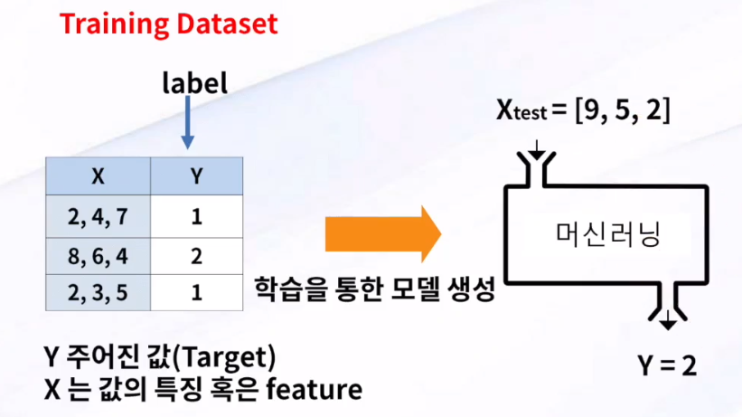

# 1강 딥러닝을 위한 머신러닝의 이해

Property: Feb 27, 2020 8:02 PM

# 머신러닝이란 무엇인가

머신러닝을 잘 이해하고 활용하는 것이 super power 를 가지는 일이다!

## 머신러닝의 등장 배경

### 명시적 프로그래밍(explicit programming)의 한계

ex) 스팸 메일(일일이 짜기 힘듦), 자율주행

문제를 해결하기 위해 특정 조건일때 이렇게 한다 하는 일일이 프로그래밍으로 만들어주는 형태에는 한계가 있다.

이 한계를 극복하는 것이 머신러닝. 컴퓨터 스스로가 내용을 학습하고 결과를 예측할 수 있도록 만들어주는 구조. 

## 머신러닝의 특징

주어진 데이터를 이용해 컴퓨터가 스스로 학습

데이터의 양이 많을수록 더 좋은 특징들 발견 (정확도 상승)

대부분 지도학습(Supervised Learning) 패러다임 기반

데이터를 통해 컴퓨터 스스로 FUNCTION 을 찾아낸다!

## 지도학습과 비지도학습

### 지도학습(Supervised Learning)

트레이닝 데이터를 기준으로 타겟 데이터를 보면서 학습

머신러닝에서 일반적으로 사용하는 방법

결과들을 알고있는 트레이닝 데이터 셋을 활용해서 학습

룰을 만들어내고, 어떤 결과일지 예측하는 형태

ex) 

​	이미지 인식

​	신용평가 시스템

​	사기방지 시스템

​	자동 스팸 필터

​	시험 점수 예측

### 비지도학습 (Unsepervised Learning)

타겟데이터가 없다.

데이터를 보고 레이블 없이 프로그램 스스로 학습 (Un-labeled data)

ex)

​	구글 뉴스 그룹핑

​	단어 중 비슷한 그룹

​	클러스터링 알고리즘 대부분

## 머신러닝의 모델 생성단계

### 지도학습

training data set 을 학습하고 다시 data set 을 이요하여 예측을 실시, 이를 통해 생성된 model 을 얻는다.

어떤 블랙박스가 있어서 기계가 스스로 학습할 수 있는 상황이 되어야 한다. 이 안에 학습 데이터(training data set)을 준다.

학습 데이터는 특징을 표현하는 X 값, 결과를 표현하는 Y 값이 있다.

Y 값에는 target data 가 포함되어있어야 한다.

= 특징 & 결과들이 함께 있을 수 있게 데이터를 구성한다.

머신러닝은 스스로 학습하면서 model, 즉 rule 을 만들어낼 수 있다. 이 model 에 의해 새로운 데이터의 결과값을 예측한다.

트레이닝 데이터셋과 테스트 데이터셋이 존재하게 된다. 

세 가지 정도 예측

1. 숫자를 예측(prediction)
2. 카테고리를 예측(classfication)

    Binary classification

    multi-labed classification