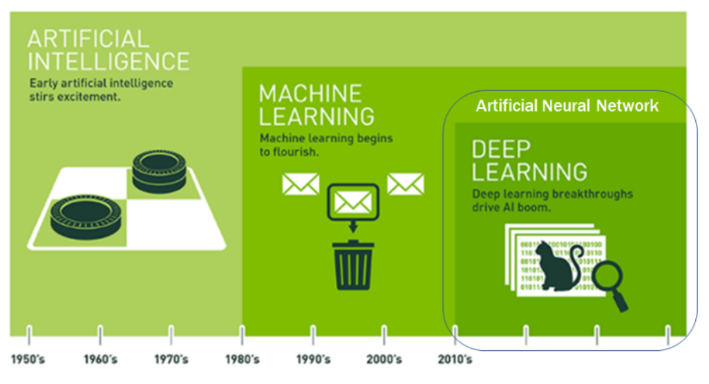
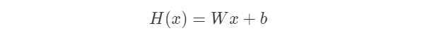
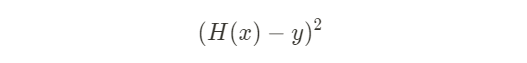
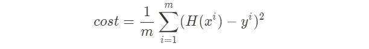
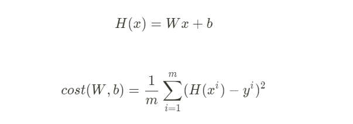
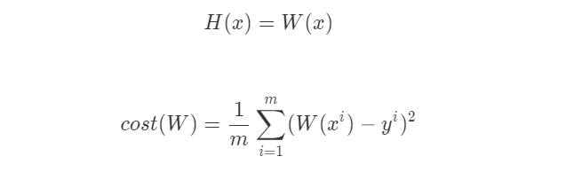

# 인공지능 기초 학습

## 인공지능이란 무엇인가?

([https://brunch.co.kr/@gdhan/1](https://brunch.co.kr/@gdhan/1))

### 인공지능의 정의

인공지능이 무엇인지는 아직 명확하지 않다. 

인간처럼 생각하는 | 인간처럼 행동하는 | 이상적으로 생각하는 | 이성적으로 행동하는

#### 인공지능 효과

인공지능의 개념은 시간의 흐름에 따라 변화한다. 인공지능의 영역으로 여겨졌던 문자 식별, 검색엔진, 장기, 체스, 기계번역 등이 예전만큼의 지능적 활동으로 여겨지지 않는 것을 **인공지능 효과**라고 한다. 

즉, 예전에 인공지능이라고 불렸지만 실용화되어 하나의 분야를 구성하면서 이제 더이상 인공지능이라고 불리지 않는 현상을 말한다.

#### 인공지능의 유형

**레벨1. 단순한 제어 프로그램**

단순한 제어 프로그램 탑재 제품을 마케팅적으로 '인공지능 탑재'라고 광고하는 경우

**레벨2. 고전적 인공지능**

입력과 출력의 패턴이 다양하고 세련된 경우를 말한다. 추론/탐색, 지식베이스를 활용한다. 

**레벨3. 머신러닝**

머신러닝(기계학습)을 활용하는 인공지능이다. 레벨2+머신러닝==레벨3

**레벨4. 딥러닝**

딥러닝을 이용하는 경우. 학습 입력값의 특징feature 을 사람이 입력하지 않고 기계가 학습하는 방식의 인공지능

### 인공지능의 발전

**규칙기반 인공지능**

계산주의.

계산을 수행할 때 기호와 연산의 규칙에 기반해서 발전했다.

어떻게 기호화할 것인가와 기호들과 규칠을 어떻게 활용해 지능적 추론을 할 것인가의 답을 위한 노력이다.

실세계의 형상을 모두 기호화 할 수 있는가라는 한계의 부딪혀 쇠락했다.

**연결주의 인공지능**

신경들 사이의 연결

개체를 다른 모든 정보와 연결되어 있다고 생각한다.

연결주의 기반 인공지능을 '신경망 기반 AI'라고 한다.

→ 딥러닝

**통계기반 인공지능**

문제 자체를 통계적으로 어떻게 풀 것인가.

데이터를 수지화해 통계적으로 파악, 해결한다.

특징  설계 → 평가 과정 → 최적화 과정

**현재**

풍부한 데이터가 확보되고 컴퓨팅 성능이 향상하면서 인공지능도 더 발전했다.

현재는 다양한 분야의 기법들이 융합되어 이용되고 있다.

자연어 처리, 음성인식, 전문가 시스템, 로봇, 컴퓨터 비전, ...

## 머신러닝이란 무엇인가

머신러닝이란 컴퓨터가 데이터를 학습함으로써 기존 데이터와 유사하지만 처음 보는 데이터를 자동으로 해석할 수 있게 하는 기법을 지칭한다.

머신러닝을 잘 이해하고 활용하는 것이 super power 를 가지는 일이다!

### 머신러닝의 등장 배경

#### 명시적 프로그래밍(explicit programming)의 한계

ex) 스팸 메일(일일이 짜기 힘듦), 자율주행

문제를 해결하기 위해 특정 조건일때 이렇게 한다 하는 일일이 프로그래밍으로 만들어주는 형태에는 한계가 있다.

이 한계를 극복하는 것이 머신러닝. 컴퓨터 스스로가 내용을 학습하고 결과를 예측할 수 있도록 만들어주는 구조. 

### 머신러닝의 특징

주어진 데이터를 이용해 컴퓨터가 스스로 학습한다.

데이터의 양이 많을수록 더 좋은 특징들 발견할 수 있다. == 정확도 상승

대부분 지도학습(Supervised Learning) 패러다임에 기반한다.

### 머신러닝의 종류

#### 지도학습(Supervised Learning)

트레이닝 데이터를 기준으로 타겟 데이터를 보면서 학습

머신러닝에서 일반적으로 사용하는 방법

결과들을 알고있는(==라벨링 되어 있는, 평가가 되어있는) 트레이닝 데이터 셋을 활용해서 학습

룰을 만들어내고, 어떤 결과일지 예측하는 형태

Classificaion 과 Regression, Prediction 으로 나뉘고,

​	다시 Binary Classification 과 Multi-label Classification 으로 나뉜다.

Regression

​	연속된 값을 예측하는 문제를 말한다. 

​	어떤 패턴이나 트렌드, 경향을 예측할 때 사용한다.

ex) 

​	이미지 인식

​	신용평가 시스템

​	사기방지 시스템

​	자동 스팸 필터

​	시험 점수 예측

##### 지도학습의 모델 생성 단계

training data set 을 학습하고 다시 data set 을 이요하여 예측을 실시, 이를 통해 생성된 model 을 얻는다.

어떤 블랙박스가 있어서 기계가 스스로 학습할 수 있는 상황이 되어야 한다. 이 안에 학습 데이터(training data set)을 준다.

학습 데이터는 특징을 표현하는 X 값, 결과를 표현하는 Y 값이 있다.

Y 값에는 target data 가 포함되어있어야 한다.

= 특징 & 결과들이 함께 있을 수 있게 데이터를 구성한다.

머신러닝은 스스로 학습하면서 model, 즉 rule 을 만들어낼 수 있다. 이 model 에 의해 새로운 데이터의 결과값을 예측한다.

트레이닝 데이터셋과 테스트 데이터셋이 존재하게 된다. 

#### 비지도학습 (Unsepervised Learning)

타겟데이터가 없다.

데이터를 보고 라벨 없이 프로그램 스스로 학습한다. (Un-labeled data)

숨어있는 패턴이나 형태를 찾아야 한다.

데이터가 분리되어 있는지(Categorial data) 연속적인지(Continuous data)로 나눈다.

실제로는 데이터의 라벨이나 카테고리를 알 수 없는 경우가 많기 때문에 중요하다.

ex)

구글 뉴스 그룹핑

단어 중 비슷한 그룹

클러스터링Clustering 알고리즘 대부분

#### 강화학습 (Reinforcement Learning)

데이터가 정답이 있지도 않고, 데이터가 없을 수도 있다.

자신이 한 행동에 대한 '보상'을 알 수 있어서 그로부터 학습하는 것을 말한다.

환경과 상호작용하면서 하는 학습이라고 할 수 있다.

보상reward 받는 행위를 반복학습Trial and Error 해서 보상을 극대화하는 것이 목표이다.

## 선형회귀분석

(재택학습 중 이러닝 *[텐서플로우딥러닝]4과목_Basic Definition for Deep Learning* 을 정리)

### 정의

하나 또는 그 이상의 독립변수(feature)들이 종속변수(target)에 미치는 영향을 추정할 수 있는 통계 기법

독립변수가 한 개: 단순선형회귀분석
독립변수가 두 개 이상: 다중선형회귀분석

두 변수 사이의 인과관계를 설명하는 기법

조건, feature 가 있으면 더 정확한 예측이 가능하다.

많은 선을 그려봤을 때 최적의 선 하나(**추정선**)을 어떻게 구할 수 있을까 의 답을 구하는 과정이 선형회귀분석이다.

정확하게 선 위에 점이 있지 않기 떄문에, 점에는 error 가 있음. 이 에러가 더해지면 정확한 값을 추정할 수 있다. 

가장 잘 관통한 점을 찾았을 때, 잔차들의 값이 0 이 되는 것이 가장 이상적이다.

잔차값 하나하나는 서로 독립이다. 평균은 0이며 σ²을 따르는 정규분포의 형태이다.

### 회귀 계수의 추정

회귀식이 어떨때 가장 적절한 추정선일까?

⇒ 잔차를 다 더했을 때 0이 되는 선

⇒ 잔차 편차의 제곱의 합이 최소인 선 == 최적의 회귀선

⇒ **최소제곱법, 최소자승법**

### 회귀 계수의 가설검정

우리가 가지고 있는 데이터 x, y 사이에 아무런 연관관계가 없더라도, 즉 선형적인 관계가 없더라도 적절한 회귀식을 찾아낼 수 있다.

통계분석으로 만들어진 회귀식은 **가설검정 단계를 반드시 거쳐야 한다.**

**분석 목적에 따라 가설이 생성된다.**

귀무가설: 추정한 회귀식이 아무런 의미가 없다.
대립가설: 추정한 회귀식이 적절하다.

t-검정을 통해 t 값이 의미하는 p-value 를 도출해서 

p-value < 0.05 ⇒ 대립가설 선택
p-value > 0.05 ⇒ 귀무가설 선택

### 선형회귀식의 설명력

여러 개의 변수라면, 어떤 게 가장 설명력이 좋은 선인지 확인

- 전체제곱합(SST)
- 회귀제곱합(SSR)
- 오차제곱합(SSE)

SST = SSR + SSE

#### 전체제곱합

모든 점들과 평균과의 차이들을 제곱하여 더한 것

편차들이 크기로 설명력을 판별한다.

전체 데이터들을 평균으로 설명할 수 있는 설명력을 표현 가능

모든 값을 더하면 0이 되므로 제곱하여 양수화한 다음 더한 것이 전체제곱합

평균으로 이 데이터를 얼마나 잘 표현할 수 있는지에 대한 설명력을 의미한다.

#### 회귀제곱합

평균과 회귀식을 통해 추정된 값들의 차이 == 회귀식의 설명력

추정된 y 값 - 실제 y 의 평균값

#### 오차제곱합

우리가 구한 회귀식을 통해 나온 y 값과 실제 y 값 (잔차)의 제곱합

#### 결정계수 R square

결정계수 R² == 회귀제곱합/전체제곱합

전체 데이터를 회귀식으로 얼마나 잘 설명하고 있는가

0 ≤ R² ≤ 1

전체 데이터를 회귀모형이 설명할 수 있는 양(단순회귀분석에서는 상관계수 r 의 제곱과 같다.)

결정계수가 1에 가까울수록 회귀모형이 전체 데이터를 잘 설명하고 있다고 말한다.

### 머신러닝에서의 선형회귀 모델

머신러닝에서는 training data 를 제일 잘 설명하는 직선을 찾는 것이 목적이다.

가장 좋은 모형을 선택하기 위해서는 적절한 모형, 적절한 데이터가 필요하다.

통계분석은 데이터를 나누지 않고 가설로 분석하지만,
머신러닝은 트레이닝 데이터와 테스트 데이터로 학습 → 검정을 거친다.
**데이터가 상대적으로 많아 가설이 필요없다.**

통계분석과 머신러닝의 가장 큰 차이는 **데이터 수** 라고 할 수 있다.

모형을 선택할 때, 데이터 그 자체를 보고 판단한다.

H(x): 가설(Hypothesis), W: 가중치(Weight), B: 편의(Bias)

계쏙 W 와 B 를 바꿔가며 try, error 반복

#### Cost(=Loss) function

구하는 가설과 실제 데이터와의 차이(잔차) ⇒ 머신러닝에서 Cost

차이가 클 때는 Penalty(벌점)을 더 주고, 차이가 작으면 패널티를 상대적으로 덜 주기 때문에 비용을 계산하기에 효과적이다.

m : 트레이닝 데이터의 개수
i: 임의의 트레이닝 데이터 인덱스
H(x): x에서의 가설 상 예측 값
y: x에서의 실제 값

우리가 세운 가설과 실제 데이터가 얼마나 맞는지 확인한다.

W 와 b 의 값에 따라 cost 가 달라진다. 즉, Cost Function 은 W 와 b 에 대한 식이다.

#### 어떻게 하면 Cost 를 최소화 할 수 있을까?

- Hypothesis and cost

- Simplified hypothesis

    

W 를 계속 바꾸면서 Try & Error 과정을 거쳐 최소 Cost 를 선택한다.

단순선형회귀식의 cost function 은 항상 2차원 곡선 형태이다.

cost 사이사이를 어떻게 구분할지, 어떻게 변화하는지 제시하는 일을 해줘야 한다. 그렇지 않으면 아무리 컴퓨터라도 부하걸릴 것....

어떻게 하면 빨리 최적의 값을 찾을 수 있을까?

⇒ 경사하강법

### 경사하강법 (Gradient descent algorithm)

cost function 을 구하는 가장 대중적인 계산법이다.

- cost function 을 minimize 하는 알고리즘
- 경사를 따라 내려간다는 알고리즘
- 초기값을 설정해서 그 값을 계속 빠꿔준다 → cost 가 줄어드는 방향으로
- 핵심은 미분을 통해 기울기를 찾아나가는 것
- 학습율도 잘 설정해야 한다. (너무 높으면 갑자기 값이 뛰고, 너무 적게 하면 많은 계산을 해야 한다.)

#### Convex function

볼록 함수. 수렴하는 지점이 단 한군데(Global Minimum)

항상 Gradient 가 답을 제공한다.

**경사하강법이 잘 동작할 수 있도록 Cost Function 이 Convex 모양인지 확인하는 것이 중요하다.**

(선형식에서는 잘 동작하지만, 로지스틱 회귀분석에서는 Local Minimum에 빠질 수 있다. = 경사하강법 오작동)

## 딥러닝

딥러닝은 머신러닝의 방법론 중 하나이다. 또한 인공 신경망의 한 종류이다.

## 신경망(Neural Network)

뉴런Neuron: 하나의 수를 담는 변수

뉴런 안의 수 == 활성치Activation

뉴런들이 하나의 레이어layer 를 구성한다.

한 레이어의 활성화가 다른 층의 활성화를 불러일으킨다.

가장 마지막 레이어가 결과를 나타낸다.

각 뉴런에 가중치를 부여해서 가중치의 합을 구해 활성화한다.

가중치의 합이 0보다 크더라도 활성화되지 않게 하려고 더하는 숫자를 bias 라고 한다.

모든 뉴런과 뉴런 간에 가중치가 있고, 뉴런마다 바이어스가 있다.