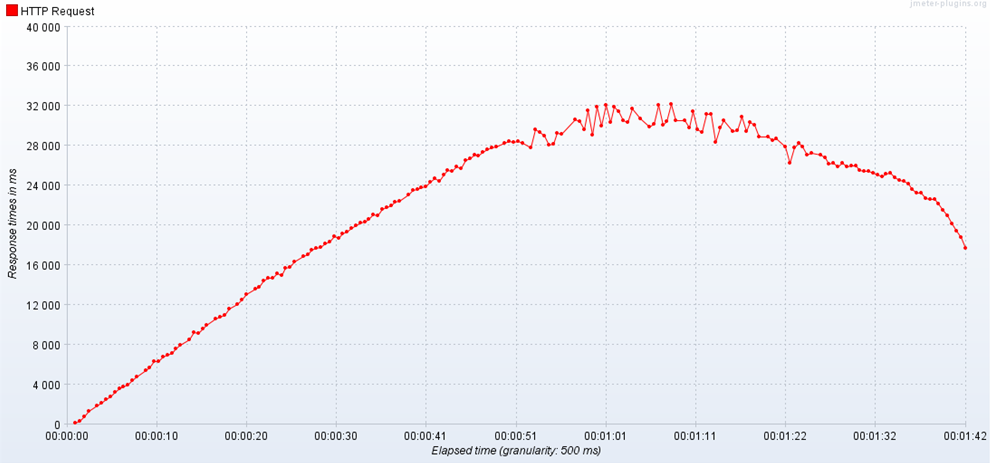

# 5일차 최적화 프로젝트

Created: Mar 13, 2020 1:40 PM

# 웹 어플리케이션 성능 향상을 위한 캐시 적용

## 캐시란 무엇인가?

### 캐시

🍪 쿠키, 세션, 캐시

- 쿠키

    브라우저에 저장되는 내용

    사용자가 가지고 있는 정보

    개발자가, 혹은 사용자가 직접 수정하거나 지울 수 있다.

    민감하거나 중요한 정보는 쿠키에 담아두지 않는 게 좋다.

    사용자의 편의를 위하되, 많이 중요하지 않은 정보

- 세션

    정보를 총괄하는 부분.

    쿠키에 주기 곤란한 정보, 서비스 제공자가 직접 관리할 정보들을 보관한다.

    세션에서는 브라우저에 키를 주고, 쿠키에 키를 담고 다니면서 http 로 보여준다.

    세션을 남발하면 접속자가 많을 때 부하가 걸릴 수 있다.

- 캐시

    가져오는 데 비용이 드는 데이터를 한번 가져온 뒤에 임시로 저장해둔다.

    데이터를 사용자의 컴퓨터 혹은 중간 서버에 저장한다.

    처리 속도는 빠르지만 비용이 비싸다.

## Redis 적용

Django 기반 영화 추천 웹 앱에 적용해보았다.

Redis 서버를 설치한 뒤,

`pip install django-redis`

```python
# settings.py

CACHES = {
    'default': {
        'BACKEND': 'django_redis.cache.RedisCache',
        'LOCATION': 'redis://127.0.0.1:6379/1',
        'OPTIONS': {
            'CLIENT_CLASS': 'django_redis.client.DefaultClient',
        }
    },
}
```

cache 저장소를 redis 로 설정했다.

```python
# views.py
from django.core.cache import cache

def movie_list(request):
    
		...
 
    boxoffices = Boxoffice.objects.all()
```

기존에는 요청 보낼때마다 데이터를 전부 가져왔었는데,

```python
# views.py
from django.core.cache import cache

def movie_list(request):
	  
		...
    
    boxoffices = cache.get('boxoffice')
    if not boxoffices:
        data = Boxoffice.objects.all()
        cache.set('boxoffice', data, 60*60*24)
```

캐시에 저장하고 하루 단위로 갱신하도록 바꿨다.

## 캐시 적용 전후의 성능 비교

Jmeter 로 응답시간과 TPS 를 비교했다. 

Thread = 100
StartupTime = 20sec
Hold Load = 60sec
Shutdown = 10sec

### 적용 전

- 응답시간

    

- TPS

    

### 적용 후

- 응답시간

    

- TPS

    

속도가 매우 빨라졌다고 생각했는데, 오류도 함께 늘어서 의문이 남는다.