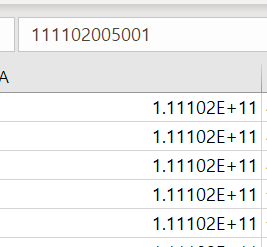

# 6일차 데이터 적재 및 가공

Created: Mar 16, 2020 4:34 PM

# DB 데이터 적재 및 가공

## 환경설정

MariaDB 는 사용해봤으니 MySQL 의 워크벤치를 사용해보기로 했다.

MySQL Workbench 6.3 버전으로 작업했다.

8.0 이상의 최신버전은 한글 파일을 import 할 때 오류가 발생한다.

(처음에 최신버전으로 작업하다가 오류를 직접 경험하고 재설치했다.)

## 데이터 다운로드 및 가공

### 사용한 데이터

- 도로명주소

    도로명코드, 도로명, 읍면동일련번호, 시도명 간단한 형태

    도로명코드가 12자리로 텍스트 형태의 숫자로 표현 방식을 바꿔도

    이렇게 표현되는데,

    

    사용자지정 > ############ 로 바꾸니 원하는대로 출력되었다.

- 선별진료소

    주소와 대표자 전화번호에 콤마(`,`) 가 들어가서 csv 로 import 하면 컬럼이 밀릴 것이다.

    애초에 엑셀에서 `,` 를 `|` 로 바꿔 이를 방지했다.

### 유니코드

기본 csv 데이터는 utf8이 아니라서.. 저장할 때 utf8로 옵션을 줬다.

## 테이블 생성

### 입력자

입력자를 내 아이디로 지정해야 하므로, default 값을 줬다.

### 입력일자

데이터타입 `TIMESTAMP` , default `now()` 로 데이터가 입력되면서 자동으로 채워진다.

## MySQL 로 import & export

- 도로명주소

    

- 선별진료소

    