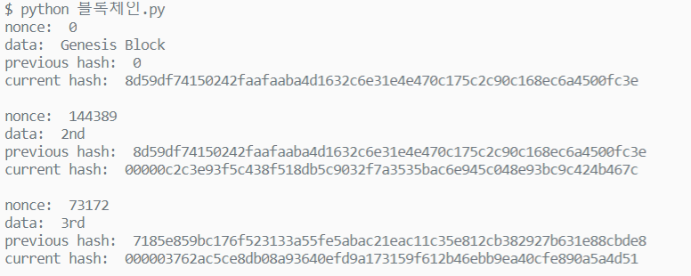

# 8일차 블록체인

Created: Mar 18, 2020 10:05 AM

# 블록체인 구현

## 블록체인

### 블록체인이란?

블록체인 ( block chain ) 은 관리 대상 데이터를 '블록'이라고 하는 소규모 데이터들이 P2P 방식을 기반으로 생성된 체인 형태의 연결고리 기반 분산 데이터 저장 환경에 저장하여 누구라도 임의로 수정할 수 없고 누구나 변경의 결과를 열람할 수 있는 분산 컴퓨팅 기술 기반의 원장 관리 기술이다. 이는 근본적으로 분산 데이터 저장기술의 한 형태로, 지속적으로 변경되는 데이터를 모든 참여 노드에 기록한 변경 리스트로서 분산 노드의 운영자에 의한 임의 조작이 불가능하도록 고안되었다. 블록체인 기술은 비트코인을 비롯한 대부분의 암호화폐 거래에 사용된다. 암호화폐의 거래과정은 탈중앙화된 전자장부에 쓰이기 때문에 블록체인 소프트웨어를 실행하는 많은 사용자들의 각 컴퓨터에서 서버가 운영되어, 중앙에 존재하는 은행 없이 개인 간의 자유로운 거래가 가능하다.
([https://ko.wikipedia.org/wiki/블록체인](https://ko.wikipedia.org/wiki/%EB%B8%94%EB%A1%9D%EC%B2%B4%EC%9D%B8))

블록 = 관리 대상 데이터
체인 = 연결고리

블럭들은 해시값 참조로 연결되어 있다.

### 블록 해시

해시함수란 임의의 길이의 데이터를 고정된 길이의 데이터로 매핑하는 함수이다.
(https://ko.wikipedia.org/wiki/해시_함수)

해시 함수는 다음의 특성을 가진다.

1. 뭘 넣든 비슷한 길이의 알 수 없는 난수가 결과로 출력된다. 
2. 글자가 한글자만 바뀌어도 완전히 다른 결과가 출력된다. 
3. 출력값으로 입력값을 예측할 수 없다.
4. 같은 내용을 입력값으로 주면 결과값은 항상 같다.

블록에 담긴 데이터를 해시하면 고정된 길이의 해시값이 출력될 것이다.

### 블록 구현

블록은 일종의 구조체이다. 블록 안에

- 이전 블록의 해시값을 기억할 변수
- 현재 블록에서 간직해야 할 데이터

두 가지가 최소한의 모델에 필요한 내용이라고 할 수 있다.

### 블록체인 구현

블록은 직전 블록과 관계를 맺어야 한다. 이 관계는 해시값을 통해 성립한다. 이전 블록의 해시값을 현재의 블록이 기억하고, 다음 블럭이 기억하고, ... 반복함으로써 블록 간 관계를 형성하고 이를 블록체인이라 한다.

처음 생성된 블럭, Genesis 블럭은 직전 블록이 없기 때문에 해시값도 없고, empty 값 혹은 random 값을 가진다.

## 작업 증명(Proof Of Work)

### 블록 수정

최초의 블록값이 1byte 라도 달라진다면 해시값도 완전히 달라진다. 두 번째, 세 번째, ... 블록의 해시값도 바뀐다. 

이전 블록을 변경한다는 것은 이후의 블록 모두가 변경된다는 것을 의미한다. 하지만 현대 컴퓨터는 빠른 속도로 처리할 수 있기 때문에 일종의 숙제(work)를 줘서 컴퓨터도 빠른 시간에 블록을 만들지 못하도록 해야 한다.

### Nonce

기존 변수를 변경하지 않으면서 다른 변수를 추가하여 인스턴스 값이 달라지게 한다. 이렇게 조건에 맞는 해시값이 나올 때까지 변수를 바꾼다. 이런 목적으로 추가하는 변수를 nonce 라고 한다.

### POW

nonce 를 바꾸며 해시를 만들다보면 조건에 맞는 해시값이 나오게 될 것이다. 이렇게 난이도를 조정해서 해시를 구하는 시간을 조절할 수 있다. 

nonce 를 변경해가며 최종 해시를 구하는 것을 작업증명이라고 한다. 

## 구현

- 해시함수는 sha256 을 사용한다.
- Genesis 블록을 생성한다.
- Genesis 블록 해시값을 다음 블록에서 기억한다.
- 해시값은 앞에 `0` 이 5개인 경우에만 통과한다.
- 블록이 생성될 때마다 블록 내용을 출력한다.
- 세 개 이상의 블록을 생성한다.
- Python 으로 구현했다.

([https://seulcode.tistory.com/409?category=758003](https://seulcode.tistory.com/409?category=758003))

```python
from hashlib import sha256

class Block:
    def __init__(self, data, previous_hash, nonce=0):
        self.data = data
        self.previous_hash = previous_hash
        self.nonce = nonce
        self.hash = self.generate_hash()
		
		# 블록 정보 출력 부분
    def print_block(self):
        print('nonce: ', self.nonce)
        print('data: ', self.data)
        print('previous hash: ', self.previous_hash)
        print('current hash: ', self.generate_hash())
        print()
        
    # data + 직전 해시 + nonce 로 해시를 만든다.
    def generate_hash(self):
        block_contents = str(self.data) + str(self.previous_hash) + str(self.nonce)
        block_hash = sha256(block_contents.encode())
        return block_hash.hexdigest()
    
    
class Blockchain:
    # 모든 chain 과 데이터를 저장하는 list 를 만들고,
    # genesis block 을 생성한다.
    def __init__(self):
        self.chain = []
        self.all_data = []
        self.genesis_block()

    def genesis_block(self):
        data = 'Genesis Block'
        block = Block(data, 0)
        self.chain.append(block)
				# genesis block 출력
        Block.print_block(block)
        return self.chain

    def add_block(self, data):
        previous_block_hash = self.chain[len(self.chain)-1].hash
        new_block = Block(data, previous_block_hash)
        proof = self.proof_of_work(new_block)
        self.chain.append(new_block)
				# 새로 생성한 블록 출력
        Block.print_block(new_block)
        return proof, new_block

    def proof_of_work(self, block, difficulty=5):
        proof = block.generate_hash()
				# 문제에서 요청한대로 '00000' 으로 시작하도록 난이도를 주었다.
				# 맞는 값을 찾을때까지 계속 nonce 값을 더한다.
        while proof[:5] != '0'*difficulty:
            block.nonce += 1
            proof = block.generate_hash()
        return proof
```

- 실행

```python
ssafy = Blockchain()
ssafy.add_block('2nd')
ssafy.add_block('3rd')
```

- 아래와 같이 생성된다.

